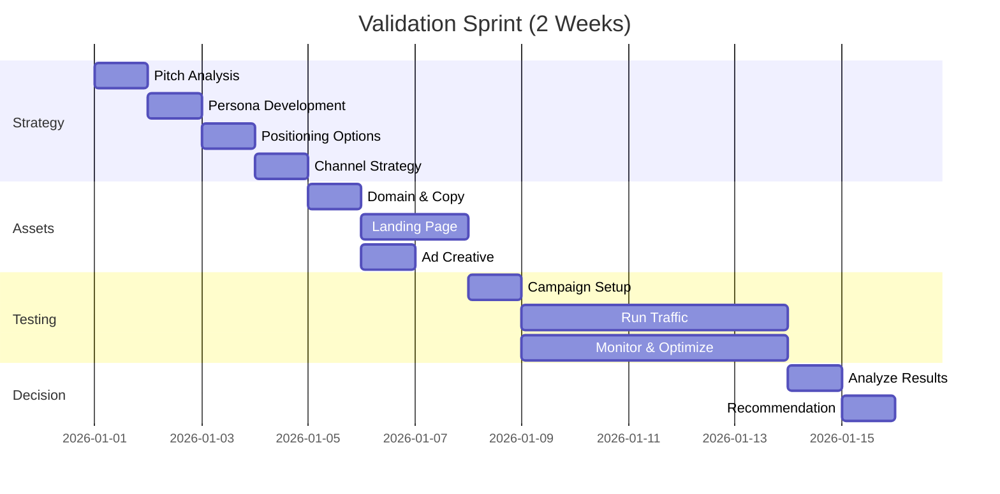
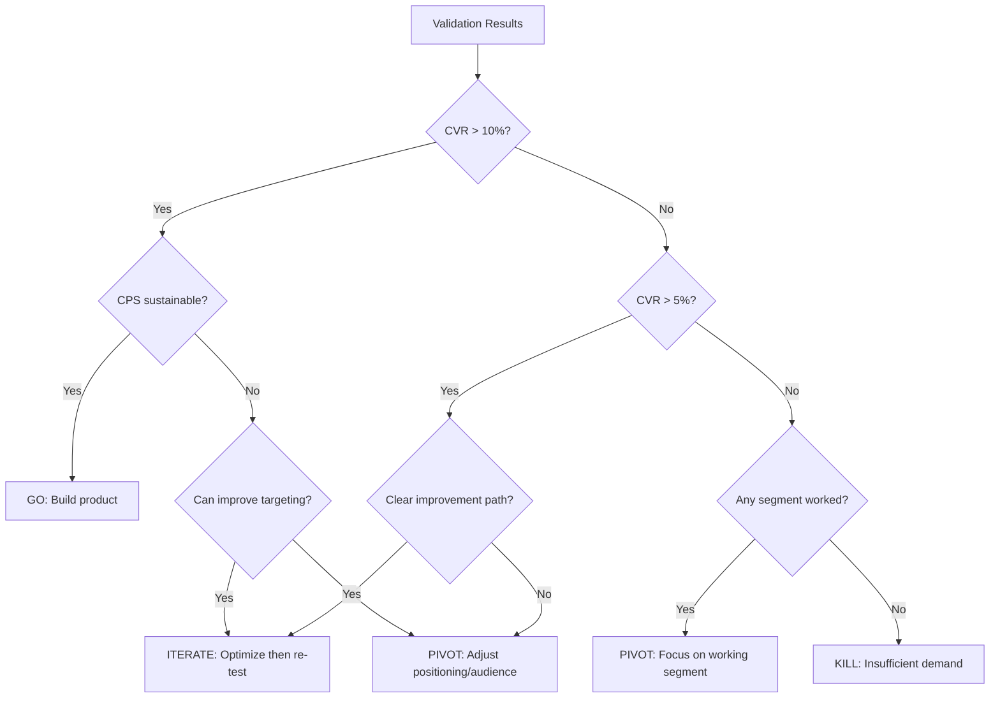

# Validation Sprint

> A 1-2 week process for testing market demand before building a product. The goal is to answer: "Should we build this?" with data, not opinions.

---

## 1. Overview

### 1.1 When to Use

Use a validation sprint when:
- Testing a new product idea
- Entering a new market or segment
- Validating a major pivot
- Testing pricing or positioning
- Gauging interest before significant investment

Do NOT use when:
- The product already exists and is selling
- You have strong existing customer data
- The timeline doesn't allow for testing
- The decision has already been made

### 1.2 Sprint Structure



### 1.3 Inputs Required

Before starting:
- [ ] Elevator pitch (1-2 paragraphs)
- [ ] Budget for ad spend ($500-2000 minimum)
- [ ] Decision-maker availability for approvals
- [ ] Domain purchasing capability
- [ ] Landing page hosting ready

### 1.4 Outputs Delivered

Sprint produces:
- Validated (or invalidated) market hypothesis
- 2-4 tested personas with performance data
- 2-3 tested positioning strategies
- Winning copy and creative
- Conversion data and benchmarks
- Go/Pivot/Kill recommendation with reasoning

---

## 2. Phase 1: Strategy (Days 1-4)

### 2.1 Day 1: Pitch Analysis

**Objective:** Extract testable hypotheses from the elevator pitch.

**Activities:**

1. **Deconstruct the pitch**
   ```markdown
   ## Pitch Extraction
   
   **Problem:** [What pain point does this solve?]
   **Solution:** [What does the product do?]
   **Mechanism:** [How does it work?]
   **Differentiator:** [Why this over alternatives?]
   **Value metric:** [How is value measured?]
   ```

2. **Form hypotheses**
   ```markdown
   ## Hypotheses to Test
   
   H1: [Target persona] experiences [problem] severely enough to seek solutions
   H2: [Target persona] would pay [price range] to solve [problem]
   H3: [Solution approach] resonates better than [alternative approaches]
   H4: [Channel] is an effective way to reach [target persona]
   ```

3. **Define success criteria**
   ```markdown
   ## Validation Thresholds
   
   | Signal | Weak | Moderate | Strong |
   |--------|------|----------|--------|
   | Landing page CVR | <5% | 5-15% | >15% |
   | Ad CTR | <0.5% | 0.5-2% | >2% |
   | Cost per signup | >$20 | $5-20 | <$5 |
   | Pricing page clicks | <10% | 10-30% | >30% |
   ```

**Deliverable:** Hypothesis document with success criteria.

### 2.2 Day 2: Persona Development

**Objective:** Create 2-4 distinct, testable persona hypotheses.

**Activities:**

1. **Generate persona candidates**
   
   For each potential audience segment:
   ```markdown
   ## Persona: [Name] the [Role]
   
   **Demographics:**
   - Age: [range]
   - Role/Title: [specific]
   - Company size: [if B2B]
   - Income/Budget: [range]
   
   **Psychographics:**
   - Primary motivation: [why they'd buy]
   - Key frustration: [specific pain]
   - Risk tolerance: [early adopter/mainstream/laggard]
   
   **Channel presence:**
   - Primary channel: [where to find them]
   - Content consumption: [what they read/watch]
   
   **Hypothesis:** This persona will convert at [X]% because [reasoning]
   ```

2. **Prioritize personas**
   
   Rank by:
   - Accessibility (can we reach them affordably?)
   - Pain intensity (how badly do they need this?)
   - Willingness to pay (do they have budget?)
   - Market size (enough of them to matter?)

3. **Select 2-3 for testing**

**Deliverable:** 2-3 prioritized personas with targeting criteria.

### 2.3 Day 3: Positioning Options

**Objective:** Develop 2-3 distinct positioning strategies to test.

**Activities:**

1. **Generate positioning options**
   
   | Strategy | Description | Best For |
   |----------|-------------|----------|
   | **Problem-first** | Lead with pain point | Aware audiences |
   | **Solution-first** | Lead with capability | Technical audiences |
   | **Outcome-first** | Lead with transformation | Aspirational audiences |
   | **Comparison** | Lead with differentiation | Competitive markets |
   | **Social proof** | Lead with others' success | Risk-averse audiences |

2. **Develop messaging matrix**
   
   For each positioning:
   ```markdown
   ## Positioning: [Name]
   
   **Core message:** [One sentence]
   
   **Headline options:**
   1. [Headline A]
   2. [Headline B]
   3. [Headline C]
   
   **Subheadline:** [Supporting message]
   
   **Proof points:**
   - [Proof 1]
   - [Proof 2]
   - [Proof 3]
   
   **CTA:** [Action text]
   
   **Visual direction:** [Brief description]
   ```

3. **Match positioning to personas**
   
   | Persona | Positioning | Rationale |
   |---------|-------------|-----------|
   | [Persona 1] | [Position A] | [Why this matches] |
   | [Persona 2] | [Position B] | [Why this matches] |

**Deliverable:** 2-3 positioning strategies with copy frameworks.

### 2.4 Day 4: Channel Strategy

**Objective:** Select and plan channel mix for testing.

**Activities:**

1. **Channel selection**
   
   Based on personas, select 2-3 channels:
   
   | Persona | Primary Channel | Secondary Channel | Budget Split |
   |---------|-----------------|-------------------|--------------|
   | [P1] | [Channel] | [Channel] | [%] |
   | [P2] | [Channel] | [Channel] | [%] |

2. **Budget allocation**
   
   ```markdown
   ## Budget Plan
   
   Total budget: $[X]
   
   | Channel | Daily Budget | Duration | Total |
   |---------|--------------|----------|-------|
   | [Ch 1] | $[X] | [X] days | $[X] |
   | [Ch 2] | $[X] | [X] days | $[X] |
   
   Reserve for optimization: $[X] (10-20%)
   ```

3. **Targeting specifications**
   
   For each channel, document:
   - Audience targeting parameters
   - Geographic targeting
   - Demographic filters
   - Interest/behavior targeting
   - Exclusions

**Deliverable:** Channel plan with budgets and targeting specs.

---

## 3. Phase 2: Assets (Days 5-7)

### 3.1 Day 5: Domain & Copy

**Objective:** Secure domain and finalize all copy.

**Activities:**

1. **Domain selection**
   
   Generate 10+ options, check availability:
   ```markdown
   | Domain | Available | Price | Score |
   |--------|-----------|-------|-------|
   | [domain.com] | ✓/✗ | $[X] | [1-5] |
   ```
   
   Score based on: memorability, length, spelling clarity, brand fit.

2. **Finalize copy**
   
   For each landing page variant:
   ```markdown
   ## Landing Page: [Variant Name]
   
   **Headline:** [Final headline]
   **Subheadline:** [Final subheadline]
   **CTA:** [Button text]
   **Social proof:** [Exact text]
   
   **Benefit 1:** [Title] - [Description]
   **Benefit 2:** [Title] - [Description]
   **Benefit 3:** [Title] - [Description]
   
   **How it works:**
   1. [Step 1]
   2. [Step 2]
   3. [Step 3]
   
   **Final CTA:** [Headline + button text]
   **Footer:** [Trust text]
   ```

3. **Ad copy variants**
   
   For each channel, create 3-5 variants:
   ```markdown
   ## [Channel] Ads
   
   **Ad 1:**
   - Headline: [text]
   - Body: [text]
   - CTA: [text]
   
   **Ad 2:** ...
   ```

**Deliverable:** Purchased domain, finalized copy document.

### 3.2 Days 6-7: Landing Page & Ads

**Objective:** Build and QA all assets.

**Activities:**

1. **Landing page development**
   
   Using templates from `OUTPUTS/landing-pages.md`:
   - Build 1-2 landing page variants
   - Implement email capture
   - Set up analytics tracking
   - Configure UTM parameter handling
   - Test on mobile and desktop

2. **Ad creative development**
   
   Per platform specifications from `MARKETING.md`:
   - Create image/video assets
   - Build ad copy variants
   - Size appropriately per platform

3. **QA checklist**
   
   - [ ] Page loads in <3 seconds
   - [ ] Mobile responsive
   - [ ] Form submits correctly
   - [ ] Thank you page/message works
   - [ ] Analytics tracking fires
   - [ ] UTM parameters captured
   - [ ] Privacy policy linked
   - [ ] Ads approved by platform

**Deliverable:** Live landing page(s), ready ad creative.

---

## 4. Phase 3: Testing (Days 8-12)

### 4.1 Day 8: Campaign Setup

**Objective:** Launch campaigns with proper tracking.

**Activities:**

1. **Analytics verification**
   
   Confirm tracking for:
   - Page views
   - Form submissions
   - Button clicks
   - Scroll depth
   - Time on page
   - Traffic source (UTM)

2. **Campaign launch**
   
   For each campaign:
   - Upload creative
   - Configure targeting
   - Set budgets
   - Set bid strategy (start with automatic)
   - Enable conversion tracking
   - Launch in "learning" mode

3. **Monitoring dashboard**
   
   Set up real-time monitoring:
   ```markdown
   ## Daily Tracking Sheet
   
   | Date | Spend | Impressions | Clicks | CTR | Signups | CVR | CPS |
   |------|-------|-------------|--------|-----|---------|-----|-----|
   | Day 1 | | | | | | | |
   | Day 2 | | | | | | | |
   ```

**Deliverable:** Live campaigns, monitoring dashboard.

### 4.2 Days 9-12: Run & Optimize

**Objective:** Gather data and optimize performance.

**Daily routine:**

1. **Morning check (9am)**
   - Review overnight performance
   - Check for disapproved ads
   - Verify tracking working
   - Update tracking sheet

2. **Midday optimization (12pm)**
   - Pause underperforming ads (CTR <0.3% after 500 impressions)
   - Adjust bids if needed
   - Check landing page performance by source

3. **Evening review (5pm)**
   - Daily metrics summary
   - Identify trends
   - Plan next day adjustments

**Optimization triggers:**

| Signal | Action |
|--------|--------|
| CTR <0.5% | Test new creative |
| CTR good, CVR bad | Test landing page changes |
| One persona outperforming | Shift budget toward winner |
| CPS too high | Tighten targeting |
| All metrics bad | Review messaging fit |

**Minimum data requirements:**
- 1,000+ impressions per ad variant
- 100+ landing page visitors per variant
- 7+ days of data (weekly patterns)

**Deliverable:** 5 days of performance data, optimization log.

---

## 5. Phase 4: Decision (Days 13-14)

### 5.1 Day 13: Analysis

**Objective:** Extract insights from test data.

**Activities:**

1. **Compile results**
   
   ```markdown
   ## Results Summary
   
   **Overall:**
   - Total spend: $[X]
   - Total signups: [X]
   - Blended CPS: $[X]
   - Landing page CVR: [X]%
   
   **By Persona:**
   | Persona | Spend | Signups | CPS | CVR |
   |---------|-------|---------|-----|-----|
   | [P1] | $[X] | [X] | $[X] | [X]% |
   | [P2] | $[X] | [X] | $[X] | [X]% |
   
   **By Positioning:**
   | Positioning | Spend | Signups | CPS | CVR |
   |-------------|-------|---------|-----|-----|
   | [Pos 1] | $[X] | [X] | $[X] | [X]% |
   | [Pos 2] | $[X] | [X] | $[X] | [X]% |
   
   **By Channel:**
   | Channel | Spend | Signups | CPS | CVR |
   |---------|-------|---------|-----|-----|
   | [Ch 1] | $[X] | [X] | $[X] | [X]% |
   | [Ch 2] | $[X] | [X] | $[X] | [X]% |
   ```

2. **Hypothesis evaluation**
   
   For each hypothesis:
   ```markdown
   **H1:** [Hypothesis text]
   **Result:** Validated / Invalidated / Inconclusive
   **Evidence:** [Data supporting conclusion]
   **Confidence:** High / Medium / Low
   ```

3. **Qualitative insights**
   
   - What feedback did signups provide?
   - What questions did people ask?
   - What objections surfaced?
   - What unexpected patterns emerged?

**Deliverable:** Complete analysis document.

### 5.2 Day 14: Recommendation

**Objective:** Make and present Go/Pivot/Kill recommendation.

**Decision framework:**



**Recommendation document:**

```markdown
# Validation Sprint: [Project Name] - Recommendation

## Executive Summary

**Recommendation:** GO / PIVOT / KILL

**Key finding:** [One sentence summary]

**Confidence level:** High / Medium / Low

---

## Decision Rationale

### What Worked
- [Finding 1]
- [Finding 2]

### What Didn't Work
- [Finding 1]
- [Finding 2]

### Key Metrics vs. Targets

| Metric | Target | Actual | Status |
|--------|--------|--------|--------|
| CVR | >10% | [X]% | ✓/✗ |
| CPS | <$10 | $[X] | ✓/✗ |

---

## Recommendation Details

### If GO:
- Validated persona: [Which one]
- Validated positioning: [Which one]
- Recommended channel: [Which one]
- Projected CAC: $[X]
- Next step: [Specific action]

### If PIVOT:
- What to change: [Specific pivot]
- Why: [Evidence]
- Re-test timeline: [Duration]
- Additional budget needed: $[X]

### If KILL:
- Why: [Clear reasoning]
- Learnings to preserve: [What we learned]
- Alternative opportunities: [If any]

---

## Supporting Data

[Attach full analysis]

---

## Appendix

- Landing page screenshots
- Ad creative that performed best
- Signup feedback/comments
- Raw data export
```

**Deliverable:** Final recommendation with supporting documentation.

---

## 6. Templates & Checklists

### 6.1 Sprint Kickoff Checklist

```markdown
## Validation Sprint Kickoff

**Project:** [Name]
**Start date:** [Date]
**Decision date:** [Date]

### Pre-Sprint
- [ ] Elevator pitch documented
- [ ] Budget approved ($[X])
- [ ] Decision-maker identified: [Name]
- [ ] Hosting/domain purchasing ready
- [ ] Analytics accounts set up

### Stakeholder Alignment
- [ ] Success criteria agreed
- [ ] Approval checkpoints scheduled
- [ ] Communication channel established
```

### 6.2 Daily Standup Template

```markdown
## Day [X] Standup

**Spend to date:** $[X] / $[Total]
**Signups to date:** [X]
**Current CPS:** $[X]

### Yesterday
- [What was done]

### Today
- [What's planned]

### Blockers
- [Any blockers]

### Key decisions needed
- [Decisions required]
```

### 6.3 Sprint Retrospective

```markdown
## Sprint Retrospective

### What went well
- [Item]

### What could improve
- [Item]

### Process changes for next sprint
- [Item]

### Learnings to document
- [Item]
```

---

## References

- `MARKETING.md` - Detailed marketing strategy and asset creation
- `brief-interpretation.md` - How to clarify the initial pitch
- `OUTPUTS/landing-pages.md` - Landing page implementation
- `quality-gates.md` - Approval criteria between phases

---

*Version: 0.1.0*
