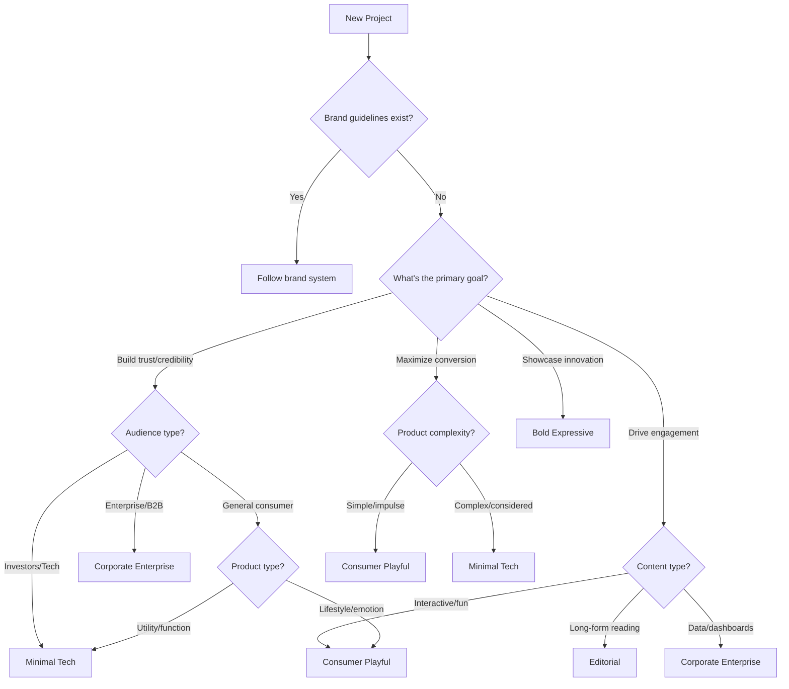
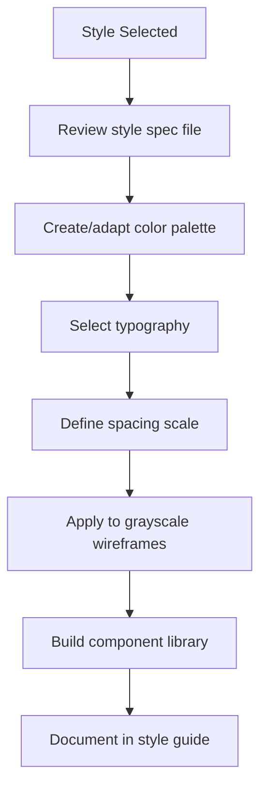

# Style Selection Guide

> This document provides heuristics for selecting the appropriate visual style for a project, and serves as an index to detailed style specifications.

---

## 1. Style Selection Framework

Style is not arbitrary preference - it's a strategic decision that signals brand positioning, meets user expectations, and serves business goals.

### 1.1 Selection Decision Tree



### 1.2 Primary Selection Factors

| Factor | Questions to Ask | Style Implications |
|--------|------------------|-------------------|
| **Industry** | What sector? What do competitors look like? | Sets baseline expectations |
| **Audience** | Age, technical sophistication, cultural context? | Determines appropriate complexity |
| **Brand personality** | Serious or playful? Premium or accessible? | Drives color, typography, spacing |
| **Content type** | Text-heavy? Data-dense? Visual? Interactive? | Shapes layout and hierarchy |
| **Conversion goal** | Impulse or considered purchase? | Affects friction and CTA treatment |
| **Device context** | Mobile-first? Desktop productivity? | Constrains density and interaction |

### 1.3 Style Mixing Rules

Styles can be combined, but with care:

**Compatible combinations:**
- Minimal Tech + Editorial (for content-heavy SaaS)
- Corporate Enterprise + Minimal Tech (for fintech)
- Consumer Playful + Editorial (for lifestyle blogs)

**Risky combinations:**
- Bold Expressive + Corporate Enterprise (conflicting signals)
- Consumer Playful + Dense Data (cognitive overload)

**Rule:** One style should dominate (80%), another can accent (20%).

---

## 2. Style Catalog

### 2.1 Minimal Tech

**Also known as:** Barely-there UI, VC aesthetic, calm tech

**Signal:** Intelligence, sophistication, focus, trust

**Best for:**
- AI/ML products
- Developer tools
- B2B SaaS
- Fintech
- Products seeking VC funding

**Key characteristics:**
- Single typeface, often geometric sans-serif
- 2-3 color palette maximum (often monochrome + one accent)
- Generous whitespace as structural element
- Subtle or no borders
- Data visualization as decoration
- Restrained interaction feedback

**Avoid when:**
- Target audience is non-technical
- Brand needs to feel warm/approachable
- Product is playful or entertainment-focused

→ See `minimal-tech.md` for full specification

---

### 2.2 Corporate Enterprise

**Also known as:** Trust-forward, professional, institutional

**Signal:** Reliability, security, expertise, scale

**Best for:**
- Financial services
- Healthcare
- Legal/compliance
- Government/institutional
- B2B enterprise software

**Key characteristics:**
- Conservative typography (often serif for headings)
- Blue-dominant palettes (trust signaling)
- Clear hierarchy and navigation
- Dense but organized information
- Trust badges and certifications prominent
- Formal tone in microcopy

**Avoid when:**
- Target audience is young/casual
- Brand wants to disrupt industry norms
- Product is consumer-focused

→ See `corporate-enterprise.md` for full specification

---

### 2.3 Consumer Playful

**Also known as:** Friendly, approachable, lifestyle

**Signal:** Fun, accessibility, personality, warmth

**Best for:**
- Consumer apps
- E-commerce (lifestyle products)
- Social platforms
- Food/beverage
- Entertainment

**Key characteristics:**
- Rounded shapes and corners
- Vibrant, warm color palettes
- Playful illustrations or photography
- Bento grid layouts
- Micro-animations on interaction
- Casual, conversational copy

**Avoid when:**
- Product handles sensitive data
- Audience expects professionalism
- Complex/high-stakes decisions involved

→ See `consumer-playful.md` for full specification

---

### 2.4 Editorial

**Also known as:** Typography-first, magazine, content-focused

**Signal:** Authority, depth, craftsmanship, premium

**Best for:**
- Publications and blogs
- Long-form content sites
- Portfolio/case studies
- Luxury brands
- Cultural institutions

**Key characteristics:**
- Typography as primary design element
- Serif fonts common (but not required)
- Strong vertical rhythm
- Generous line heights and margins
- Minimal UI chrome
- Images treated as editorial content

**Avoid when:**
- Content is primarily functional/transactional
- Users need to take quick actions
- Information density is high

→ See `editorial.md` for full specification

---

### 2.5 Bold Expressive

**Also known as:** Anti-design, brutalist, experimental

**Signal:** Innovation, creativity, disruption, confidence

**Best for:**
- Creative agencies
- Fashion/art
- Music/entertainment
- Portfolio sites
- Brand launches seeking attention

**Key characteristics:**
- Rule-breaking layouts
- High contrast, unexpected color combinations
- Oversized typography
- Intentional "imperfection"
- Experimental interactions
- Strong point of view

**Avoid when:**
- Usability is critical
- Audience is conservative
- Conversion is primary goal
- Accessibility requirements are strict

→ See `bold-expressive.md` for full specification

---

## 3. Style Discovery Process

When style is unspecified, guide the user through discovery:

### 3.1 Quick Assessment Questions

Ask in this order, stop when you have enough signal:

1. **"What 3-5 adjectives describe how this should feel?"**
   - Maps directly to style selection
   - Examples: "clean, professional, trustworthy" → Minimal Tech or Corporate
   - Examples: "fun, friendly, energetic" → Consumer Playful

2. **"Who are your closest competitors, and how do you want to position against them?"**
   - Similar = meet expectations with slight differentiation
   - Different = understand what to avoid

3. **"Show me 2-3 sites you admire (don't have to be in your industry)"**
   - Visual references beat verbal descriptions
   - Extract patterns from examples

4. **"What should this absolutely NOT look like?"**
   - Anti-references are often clearer than references
   - Helps avoid landmines

5. **"Describe your ideal customer in detail"**
   - Age, occupation, context of use
   - Informs accessibility and complexity decisions

### 3.2 Mapping Adjectives to Styles

| Adjectives | Primary Style | Secondary Consideration |
|------------|---------------|------------------------|
| Clean, minimal, focused, calm | Minimal Tech | Editorial if content-heavy |
| Professional, trustworthy, secure, reliable | Corporate Enterprise | Minimal Tech if modern |
| Fun, friendly, playful, approachable | Consumer Playful | — |
| Premium, sophisticated, elegant, refined | Editorial | Minimal Tech for tech products |
| Bold, creative, innovative, different | Bold Expressive | Use with caution |
| Warm, human, personal, authentic | Consumer Playful | Editorial for content sites |

### 3.3 Industry Defaults

When no other signals exist, these are safe starting points:

| Industry | Default Style | Rationale |
|----------|---------------|-----------|
| SaaS/Tech | Minimal Tech | Industry expectation, signals competence |
| Finance | Corporate Enterprise | Trust is paramount |
| Healthcare | Corporate Enterprise | Credibility, compliance signals |
| E-commerce (lifestyle) | Consumer Playful | Emotional purchase drivers |
| E-commerce (utility) | Minimal Tech | Efficiency matters |
| Media/Publishing | Editorial | Content is the product |
| Agency/Creative | Bold Expressive | Demonstrates capability |
| Education | Consumer Playful or Editorial | Depends on audience age |
| Legal | Corporate Enterprise | Conservative expectations |

---

## 4. Style Application Process

Once a style is selected:

### 4.1 Workflow



### 4.2 Customization Within Style

Each style is a starting point, not a straitjacket. Customize:

| Element | Customization Range | Constraints |
|---------|---------------------|-------------|
| Colors | Brand colors within palette structure | Maintain contrast ratios |
| Typography | Brand fonts if they fit style character | Maintain hierarchy ratios |
| Spacing | Can tighten or loosen 10-20% | Maintain proportional scale |
| Corners | Can adjust radius scale | Keep consistent across components |
| Animation | Can add or remove | Respect reduced-motion preferences |

### 4.3 Style Validation Checklist

Before finalizing style application:

- [ ] Does the style align with stated brand adjectives?
- [ ] Does it meet or exceed competitor baseline?
- [ ] Is it appropriate for the target audience?
- [ ] Does it support (not hinder) conversion goals?
- [ ] Does it meet accessibility requirements?
- [ ] Is it maintainable within project constraints?
- [ ] Have stakeholders approved direction?

---

## 5. Style Files Index

Detailed specifications for each style:

| Style | File | Status |
|-------|------|--------|
| Minimal Tech | `minimal-tech.md` | ✓ |
| Corporate Enterprise | `corporate-enterprise.md` | ✓ |
| Consumer Playful | `consumer-playful.md` | ✓ |
| Editorial | `editorial.md` | ✓ |
| Bold Expressive | `bold-expressive.md` | ✓ |

Each file contains:
- Detailed color palette specifications
- Typography scale and recommendations
- Spacing and grid system
- Component styling guidelines
- Interaction patterns
- Do's and don'ts with examples
- Reference sites

---

## 6. Creating Custom Styles

For projects that don't fit existing styles:

### 6.1 When to Create Custom

- Brand has strong existing identity that doesn't map to archetypes
- Hybrid positioning requires intentional blend
- Industry has unique conventions not captured

### 6.2 Custom Style Template

Document custom styles with:

```markdown
# [Style Name]

## Positioning
- What this style signals
- Best use cases
- Avoid when

## Color System
- Primary, secondary, accent
- Semantic colors
- Neutral scale

## Typography
- Font families
- Size scale
- Weight usage

## Spacing
- Base unit
- Scale

## Components
- Button styles
- Form treatments
- Card patterns
- Navigation approach

## Interaction
- Animation principles
- Feedback patterns

## References
- Example sites
- Inspiration sources
```

---

*Version: 0.1.0*
*Last updated: 2026-01-29*
