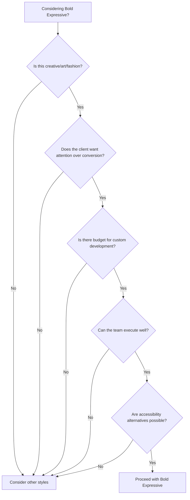

# Bold Expressive Style Specification

> The rule-breaking aesthetic that signals creativity, innovation, and confidence. High-risk, high-reward. Reserved for creative agencies, portfolios, art/fashion, and brands that need to stand out at any cost.

---

## 1. Positioning

### 1.1 What This Style Signals

- **Creativity**: "We think differently"
- **Confidence**: "We don't follow trends, we set them"
- **Innovation**: "We're not afraid to experiment"
- **Artistry**: "This is craft, not template"
- **Disruption**: "The status quo doesn't apply to us"

### 1.2 Best Use Cases

- Creative and design agencies
- Artist and designer portfolios
- Fashion and luxury fashion
- Music and entertainment
- Art galleries and cultural events
- Brand launches seeking attention
- Award submissions and case studies
- Experimental projects

### 1.3 Avoid When

- Usability is critical
- Audience is conservative or risk-averse
- Conversion is the primary goal
- Accessibility requirements are strict
- Client is in regulated industry
- Budget doesn't allow for custom development
- Timeline is tight
- Maintenance will be done by non-designers

**Warning:** This style has the highest failure rate. Use only when the brief explicitly calls for it and the team has skills to execute well.

---

## 2. Design Philosophy

### 2.1 Rule-Breaking as Method

Bold Expressive intentionally violates conventional rules—but strategically:

| Convention | Bold Expressive Approach |
|------------|--------------------------|
| Consistent grid | Intentional breaks, overlapping elements |
| Readable hierarchy | Size extremes, unexpected emphasis |
| Predictable navigation | Hidden, unusual, or discoverable |
| Standard interactions | Experimental, cursor-based, gestural |
| Accessible contrast | High contrast extremes OR intentional low contrast |
| Balanced layout | Dramatic asymmetry, tension |

### 2.2 The Golden Rule

**Every rule broken must be broken intentionally.**

Random chaos is not design. Bold Expressive requires more skill than any other style because every unconventional choice must serve a purpose.

```
Questions before breaking a rule:
1. What does breaking this convention communicate?
2. Does it serve the brand/content?
3. Can users still accomplish their goals?
4. Is it intentional or lazy?
```

---

## 3. Color System

### 3.1 Palette Approaches

Bold Expressive has multiple valid color strategies:

**A. High Contrast Monochrome**
```
Background: #000000
Text:       #FFFFFF
Accent:     #FF0000 or other single bright color
```

**B. Unexpected Combinations**
```
Primary:    #FF6B35 (Vivid Orange)
Secondary:  #004E98 (Deep Blue)
Accent:     #3AFF47 (Neon Green)
Background: #1A1A2E
```

**C. Neon on Dark**
```
Background: #0D0D0D
Neon 1:     #00FFFF (Cyan)
Neon 2:     #FF00FF (Magenta)
Neon 3:     #FFFF00 (Yellow)
```

**D. Brutalist Neutral**
```
Background: #F5F5F5
Text:       #000000
Accent:     #0000FF (Pure blue links)
```

### 3.2 Color Rules (or Lack Thereof)

- Pure black (#000000) and pure white (#FFFFFF) are acceptable
- Neon and fluorescent colors can be used
- Gradients can be dramatic and multi-colored
- Color can be used structurally (full-bleed color sections)
- Clashing colors can be intentional
- No color at all is also a choice

### 3.3 Considerations

Even in Bold Expressive:
- Text must be readable (even if barely)
- Important information should be findable
- Seizure-inducing flashing is never acceptable

---

## 4. Typography

### 4.1 Font Selection

**Display/Headline (the star):**
- Variable fonts with extreme weights
- Experimental and artistic typefaces
- Custom/commissioned letterforms
- Distorted or manipulated type

**Examples:**
- ABCMarist, ABC Favorit
- Pangaia, Monument Extended
- GT Alpina, GT America
- Right Grotesk, NeueMachina
- Any font that makes a statement

**Body (functional):**
- Can contrast dramatically with display
- Or match display in unexpected weights
- Mono fonts for brutalist aesthetic

### 4.2 Scale Extremes

| Level | Size Range | Notes |
|-------|------------|-------|
| Display | 80-300px+ | Can fill viewport |
| H1 | 48-120px | Still dramatic |
| Body | 14-18px | Readable contrast |
| Micro | 10-12px | Intentionally small |

### 4.3 Typography Treatments

Allowed and encouraged:

- **Extreme size contrast** (10px next to 200px)
- **Mixed weights** in single headline
- **Vertical text**
- **Rotated text**
- **Text as texture** (repeated, overlapping)
- **Negative tracking** (letters touching/overlapping)
- **Wide tracking** (letters extremely spaced)
- **Text masking** (text revealing images)
- **Animated type** (letters moving independently)
- **3D/layered text** (shadows, depth)
- **Distortion** (warped, stretched)

```css
/* Example: Extreme display type */
.hero-text {
  font-size: clamp(80px, 15vw, 200px);
  font-weight: 900;
  text-transform: uppercase;
  letter-spacing: -0.05em;
  line-height: 0.85;
}

/* Example: Vertical text */
.vertical-label {
  writing-mode: vertical-rl;
  transform: rotate(180deg);
  font-size: 12px;
  letter-spacing: 0.2em;
}
```

---

## 5. Layout

### 5.1 Breaking the Grid

```
Standard Grid:
┌───┬───┬───┬───┬───┬───┬───┬───┬───┬───┬───┬───┐
│   │   │   │   │   │   │   │   │   │   │   │   │
└───┴───┴───┴───┴───┴───┴───┴───┴───┴───┴───┴───┘

Bold Expressive:
┌─────────────────────────────────────────────────┐
│     ┌────────────────────────┐                  │
│     │  ELEMENT               │                  │
│     │  BREAKING              │   ┌────┐         │
│     │  BOUNDARIES            │   │    │         │
│     └────────────────────────┘   │    │         │
│                    ┌─────────────┴────┴───────┐ │
│                    │  OVERLAPPING             │ │
│  ┌─────────┐       │  CONTENT                 │ │
│  │ FLOATING│       └──────────────────────────┘ │
│  └─────────┘                                    │
└─────────────────────────────────────────────────┘
```

### 5.2 Layout Techniques

| Technique | Description |
|-----------|-------------|
| Overlap | Elements intentionally covering each other |
| Bleed | Content extending beyond viewport |
| Asymmetry | Dramatic imbalance |
| Negative space extremes | Huge gaps or no gaps |
| Mixed directions | Horizontal and vertical content flows |
| Scroll-jacking | Taking control of scroll (use carefully) |
| Z-layering | Multiple planes of content |

### 5.3 Navigation Patterns

**Unconventional options:**

- **Hidden navigation**: Revealed on click/gesture
- **Fullscreen menu**: Takes over entire viewport
- **Numbered**: Just numbers, no labels
- **Scattered**: Menu items positioned around viewport
- **Single-page scroll**: No traditional navigation
- **Keyboard-driven**: For developer audiences

```css
/* Example: Fullscreen menu */
.menu-open {
  position: fixed;
  inset: 0;
  background: black;
  display: grid;
  place-items: center;
}
.menu-item {
  font-size: 8vw;
  color: white;
  transition: color 0.3s;
}
.menu-item:hover {
  color: #FF0000;
}
```

---

## 6. Component Styling

### 6.1 Buttons (or Lack Thereof)

```css
/* Brutalist button */
.btn-brutal {
  background: black;
  color: white;
  border: 3px solid black;
  padding: 16px 32px;
  font-weight: 900;
  text-transform: uppercase;
}
.btn-brutal:hover {
  background: white;
  color: black;
}

/* Outline only */
.btn-outline {
  background: transparent;
  border: 1px solid currentColor;
  padding: 12px 24px;
}

/* Text link as button */
.btn-text {
  background: none;
  border: none;
  text-decoration: underline;
  text-decoration-thickness: 2px;
  font-weight: bold;
}
```

### 6.2 Cards

Can be unconventional:

```css
/* No border card */
.card-minimal {
  /* Just content, no container */
}

/* Heavy border */
.card-brutal {
  border: 4px solid black;
  padding: 32px;
}

/* Tilted card */
.card-tilted {
  transform: rotate(-3deg);
  transition: transform 0.3s;
}
.card-tilted:hover {
  transform: rotate(0deg);
}
```

### 6.3 Images

**Treatments:**

- Full-bleed / edge-to-edge
- Overlapping text
- Masked by text
- Duotone or posterized
- Glitch effects
- Mixed with 3D elements
- Parallax movement

```css
/* Duotone */
.duotone {
  filter: grayscale(100%) contrast(1.2);
  mix-blend-mode: multiply;
  background: #FF0000; /* Tint color */
}

/* Text mask */
.text-mask {
  background-image: url('image.jpg');
  -webkit-background-clip: text;
  -webkit-text-fill-color: transparent;
}
```

---

## 7. Interaction Patterns

### 7.1 Cursor Interactions

The cursor becomes a design element:

```css
/* Custom cursor */
body {
  cursor: none;
}
.cursor {
  position: fixed;
  width: 20px;
  height: 20px;
  background: #FF0000;
  border-radius: 50%;
  pointer-events: none;
  mix-blend-mode: difference;
}

/* Cursor effects on hover */
.interactive:hover ~ .cursor {
  transform: scale(3);
}
```

### 7.2 Scroll Effects

| Effect | Description | Use When |
|--------|-------------|----------|
| Parallax | Layers move at different speeds | Depth/immersion |
| Reveal | Content appears as you scroll | Storytelling |
| Horizontal scroll | Page scrolls sideways | Portfolio/gallery |
| Snap scroll | Locks to sections | Discrete content |
| Infinite scroll | No end | Exploration |

### 7.3 Animation Principles

More freedom than other styles:

- **Duration**: Can be longer (500ms-2s)
- **Easing**: Dramatic curves, bounces
- **Triggers**: Hover, scroll, time-based
- **Scale**: Can be extreme

```css
/* Dramatic entrance */
@keyframes dramatic-in {
  0% {
    opacity: 0;
    transform: translateY(100px) rotate(-10deg);
  }
  60% {
    transform: translateY(-20px) rotate(2deg);
  }
  100% {
    opacity: 1;
    transform: translateY(0) rotate(0);
  }
}

/* Glitch effect */
@keyframes glitch {
  0%, 100% { transform: translate(0); }
  20% { transform: translate(-2px, 2px); }
  40% { transform: translate(-2px, -2px); }
  60% { transform: translate(2px, 2px); }
  80% { transform: translate(2px, -2px); }
}
```

---

## 8. Sub-Styles

### 8.1 Brutalist

**Characteristics:**
- Raw, unpolished aesthetic
- Visible structure (borders, monospace)
- Plain HTML vibes
- Black, white, blue links
- No images or stark images

**Reference:** brutalistwebsites.com

### 8.2 Neo-Brutalist

**Characteristics:**
- Brutalist structure with contemporary touches
- Bold colors, thick borders
- Playful elements within rigid frames
- Heavy shadows

### 8.3 Anti-Design

**Characteristics:**
- Deliberately "ugly" or uncomfortable
- Challenges beauty norms
- Can be confrontational
- Makes a statement through rejection

### 8.4 Experimental

**Characteristics:**
- Pushing technical boundaries
- WebGL, 3D, generative
- May not work on all devices
- Art piece as much as website

---

## 9. Accessibility Considerations

Bold Expressive often conflicts with accessibility. Handle carefully:

### 9.1 Required Accommodations

Even in experimental design:

- [ ] Text alternatives for images
- [ ] Keyboard navigation possible
- [ ] No auto-playing audio
- [ ] Pause/stop for animations
- [ ] Reduced motion alternative
- [ ] Skip navigation for screen readers
- [ ] Focus indicators (can be styled)

### 9.2 Accessibility Statement

Consider including:

```
This site uses experimental design that may 
not be fully accessible. For accessible 
version, visit [accessible-site.com] or 
contact us at [email].
```

### 9.3 Balance Points

| Experimental | Accessible Alternative |
|--------------|----------------------|
| Low contrast text | Higher contrast version available |
| Hidden navigation | Visible nav on request |
| Motion-heavy | Reduced motion supported |
| Cursor effects | Standard cursor fallback |

---

## 10. Technical Considerations

### 10.1 Performance

Experimental effects are expensive:

- Test on low-end devices
- Provide fallbacks
- Consider data usage
- Lazy load heavy assets

### 10.2 Browser Support

- Test thoroughly
- Provide graceful degradation
- Document known limitations
- Consider feature detection

### 10.3 Maintenance

- Document non-standard code
- Consider long-term updatability
- Train maintainers

---

## 11. Do's and Don'ts

### Do's ✓

- Have a clear concept/vision
- Break rules intentionally
- Test with real users
- Provide accessible alternatives
- Document your reasoning
- Know when to pull back
- Make it memorable
- Ensure core content is findable

### Don'ts ✗

- Be chaotic without purpose
- Sacrifice all usability
- Ignore performance
- Assume everyone "gets it"
- Use for commercial conversion pages
- Force on conservative clients
- Forget mobile exists
- Create seizure/motion sickness risks

---

## 12. Reference Sites

| Site | Notable Elements |
|------|------------------|
| awwwards.com/websites/experimental | Collection of experimental |
| hfrfrw.com | Brutalist experimental |
| wolffolins.com | Creative agency bold |
| anti.ltd | Anti-design aesthetic |
| mouthwash.studio | Type-driven experimental |
| basic.agency | Creative studio portfolio |
| deck.graphics | Minimal brutalist |
| only.ginger | Fashion experimental |

---

## 13. Decision Framework

Before choosing Bold Expressive:



---

## 14. Implementation Checklist

- [ ] Clear creative concept documented
- [ ] Every rule-break has stated purpose
- [ ] Core content remains accessible
- [ ] Reduced motion alternative exists
- [ ] Mobile experience considered
- [ ] Performance tested on low-end devices
- [ ] Fallbacks for unsupported browsers
- [ ] Client understands trade-offs
- [ ] Maintenance documentation complete
- [ ] Launch includes accessibility statement

---

*Version: 0.1.0*
*Last updated: 2026-01-29*
