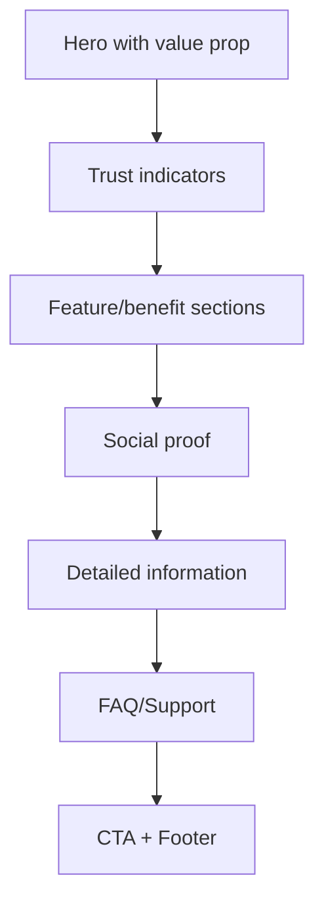

# Corporate Enterprise Style Specification

> The trust-forward aesthetic that signals reliability, security, and institutional credibility. Essential for finance, healthcare, legal, and B2B enterprise.

---

## 1. Positioning

### 1.1 What This Style Signals

- **Trust**: "Your money/health/data is safe with us"
- **Reliability**: "We've been doing this for decades"
- **Expertise**: "We know our domain deeply"
- **Security**: "We take protection seriously"
- **Scale**: "We serve major organizations"

### 1.2 Best Use Cases

- Financial services and banking
- Healthcare and medical
- Insurance products
- Legal and compliance tools
- Government and institutional
- B2B enterprise software
- Cybersecurity products
- Corporate communications

### 1.3 Avoid When

- Target audience is young or casual
- Brand wants to disrupt industry
- Product is consumer-focused lifestyle
- Speed and agility are primary brand values
- Market expects modern/startup aesthetic

---

## 2. Color System

### 2.1 Palette Structure

```
┌─────────────────────────────────────────────────────────┐
│  CORPORATE ENTERPRISE PALETTE STRUCTURE                 │
├─────────────────────────────────────────────────────────┤
│                                                         │
│  Primary ────────── Blue family (trust signaling)       │
│                     Navy #1E3A5F to Royal #2563EB       │
│                                                         │
│  Secondary ──────── Complementary or neutral            │
│                     Slate, warm gray, or muted accent   │
│                                                         │
│  Background ─────── #FFFFFF primary                     │
│                     #F8FAFC light sections              │
│                                                         │
│  Text ───────────── #1E293B primary                     │
│                     #475569 secondary                   │
│                     #94A3B8 tertiary                    │
│                                                         │
│  Border ─────────── #E2E8F0                             │
│                                                         │
└─────────────────────────────────────────────────────────┘
```

### 2.2 Primary Color Options

| Industry | Recommended Primary | Hex Range | Rationale |
|----------|---------------------|-----------|-----------|
| Banking/Finance | Navy Blue | `#1E3A5F` - `#1E40AF` | Traditional trust |
| Healthcare | Teal/Medical Blue | `#0D9488` - `#0891B2` | Calm, clinical |
| Insurance | Deep Blue | `#1E3A8A` - `#3730A3` | Stability |
| Legal | Dark Navy | `#0F172A` - `#1E293B` | Authority |
| Enterprise SaaS | Royal Blue | `#2563EB` - `#3B82F6` | Modern trust |

### 2.3 Accent Colors

Use sparingly for CTAs and highlights:

| Purpose | Color | Hex |
|---------|-------|-----|
| Primary CTA | Accent Blue | `#2563EB` |
| Secondary action | Slate | `#475569` |
| Success | Forest Green | `#16A34A` |
| Premium tier | Gold | `#CA8A04` |

### 2.4 Semantic Colors

| Purpose | Color | Hex |
|---------|-------|-----|
| Success | Green | `#16A34A` |
| Warning | Amber | `#D97706` |
| Error | Red | `#DC2626` |
| Info | Blue | `#2563EB` |

### 2.5 Color Usage Rules

- Blue should dominate but not overwhelm
- Use navy for headers/navigation, lighter blue for accents
- Maintain strong contrast for accessibility
- Gray backgrounds define sections
- Avoid bright/saturated colors outside CTAs
- Trust badges should be muted, not attention-grabbing

---

## 3. Typography

### 3.1 Font Selection

**Sans-serif (modern corporate):**
- Inter (versatile, professional)
- IBM Plex Sans (technical authority)
- Source Sans Pro (government/institutional)

**Serif (traditional authority):**
- Georgia (web-safe, editorial)
- Merriweather (readable, trustworthy)
- Libre Baskerville (classic)

**Recommended combination:**
- Headings: Serif (signals authority)
- Body: Sans-serif (ensures readability)

### 3.2 Type Scale

Base: 16px

| Level | Size | Weight | Line Height | Font | Use |
|-------|------|--------|-------------|------|-----|
| Display | 48px | 700 | 1.2 | Serif | Hero only |
| H1 | 36px | 700 | 1.2 | Serif | Page titles |
| H2 | 28px | 600 | 1.3 | Serif or Sans | Sections |
| H3 | 22px | 600 | 1.4 | Sans | Subsections |
| H4 | 18px | 600 | 1.4 | Sans | Card titles |
| Body Large | 18px | 400 | 1.7 | Sans | Intro paragraphs |
| Body | 16px | 400 | 1.7 | Sans | Primary content |
| Body Small | 14px | 400 | 1.6 | Sans | Secondary |
| Caption | 12px | 500 | 1.5 | Sans | Labels, metadata |

### 3.3 Typography Rules

- Longer line heights than Minimal Tech (more readable for dense content)
- Conservative letter-spacing (0 to +0.01em)
- Avoid light weights (under 400)
- Uppercase sparingly: navigation, labels only
- Never use decorative fonts

---

## 4. Spacing System

### 4.1 Base Unit

8px base, generous scale:

```
4px   - Micro
8px   - XS
16px  - SM
24px  - MD (standard)
32px  - LG
48px  - XL
64px  - 2XL
80px  - 3XL
120px - 4XL (hero sections)
```

### 4.2 Component Spacing

| Component | Padding | Notes |
|-----------|---------|-------|
| Button (standard) | 14px 24px | Larger than Minimal Tech |
| Input field | 14px 16px | Comfortable touch targets |
| Card | 32px | Generous internal space |
| Table cell | 16px 20px | Room for data |
| Modal | 40px | Formal presentation |
| Section | 80px vertical | Clear separation |

### 4.3 Grid System

```
Mobile:     4 columns, 16px gutters, 20px margins
Tablet:     8 columns, 24px gutters, 40px margins  
Desktop:    12 columns, 32px gutters, 80px margins
Wide:       12 columns, 32px gutters, max-width 1440px
```

Note: Wider max-width than Minimal Tech (content-dense applications).

---

## 5. Component Styling

### 5.1 Buttons

```css
/* Primary Button */
.btn-primary {
  background: var(--primary-600);
  color: white;
  border: none;
  border-radius: 4px; /* More conservative */
  font-weight: 600;
  padding: 14px 28px;
  box-shadow: 0 1px 2px rgba(0,0,0,0.05);
}
.btn-primary:hover {
  background: var(--primary-700);
}

/* Secondary Button */
.btn-secondary {
  background: white;
  color: var(--primary-600);
  border: 2px solid var(--primary-600);
  border-radius: 4px;
  font-weight: 600;
}

/* Tertiary/Text Button */
.btn-text {
  background: transparent;
  color: var(--primary-600);
  border: none;
  text-decoration: underline;
}
```

**Button Rules:**
- Border radius: 4px (conservative, trustworthy)
- Slightly larger than startup aesthetic
- Clear contrast between primary/secondary
- Underline style for tertiary actions
- Can use subtle shadows (unlike Minimal Tech)

### 5.2 Form Inputs

```css
.input {
  background: white;
  border: 1px solid var(--border);
  border-radius: 4px;
  padding: 14px 16px;
  font-size: 16px;
}
.input:focus {
  border-color: var(--primary-500);
  box-shadow: 0 0 0 3px rgba(37, 99, 235, 0.1);
}
.label {
  display: block;
  font-weight: 600;
  font-size: 14px;
  margin-bottom: 8px;
  color: var(--text-primary);
}
.helper-text {
  font-size: 14px;
  color: var(--text-secondary);
  margin-top: 8px;
}
```

**Form Rules:**
- Labels always visible (never placeholder-only)
- Required fields marked with asterisk
- Helper text encouraged for complex fields
- Error messages explicit and actionable
- Group related fields with fieldsets

### 5.3 Cards

```css
.card {
  background: white;
  border: 1px solid var(--border);
  border-radius: 8px;
  padding: 32px;
  box-shadow: 0 1px 3px rgba(0,0,0,0.1);
}
.card-header {
  border-bottom: 1px solid var(--border);
  padding-bottom: 16px;
  margin-bottom: 24px;
}
```

**Card Rules:**
- Cards can have headers with borders
- Shadows acceptable (signals elevation)
- Clear internal structure
- Can contain complex content

### 5.4 Navigation

**Header:**
- Height: 72-80px (larger than Minimal Tech)
- Logo left, primary nav center, utility nav right
- Clear active states
- Dropdown menus for complex nav

**Mega Menus:**
- Acceptable and expected for complex products
- Organized columns with headers
- Include icons for visual scanning

**Sidebar:**
- Width: 260-300px
- Full labels (not icon-only)
- Clear grouping with headers
- Expandable sections

### 5.5 Tables

```css
.table {
  width: 100%;
  border: 1px solid var(--border);
  border-radius: 8px;
  overflow: hidden;
}
.table th {
  background: var(--slate-50);
  text-align: left;
  font-weight: 600;
  font-size: 13px;
  text-transform: uppercase;
  letter-spacing: 0.05em;
  padding: 14px 20px;
  border-bottom: 1px solid var(--border);
}
.table td {
  padding: 16px 20px;
  border-bottom: 1px solid var(--border);
}
.table tr:last-child td {
  border-bottom: none;
}
```

**Table Rules:**
- Header row visually distinct (background)
- Borders around table acceptable
- Zebra striping optional but helpful for dense data
- Sortable columns indicated with icons
- Pagination for long lists

---

## 6. Trust Elements

Corporate Enterprise style relies heavily on trust signals:

### 6.1 Trust Badges

Display prominently but tastefully:

| Badge Type | Placement | Style |
|------------|-----------|-------|
| Security certs (SOC2, ISO) | Footer, security pages | Grayscale or muted |
| Compliance (HIPAA, GDPR) | Relevant pages, footer | Small, official |
| Industry awards | About page, footer | Tasteful, not flashy |
| Partner logos | Dedicated section | Grid, grayscale option |

### 6.2 Social Proof

```
┌────────────────────────────────────────────────────────┐
│  "Quote from enterprise customer about reliability"    │
│                                                        │
│  — Jane Smith, CTO                                     │
│    Fortune 500 Company                                 │
│    [Company Logo]                                      │
└────────────────────────────────────────────────────────┘
```

**Testimonial Rules:**
- Full names and titles (not "J.S., Manager")
- Company logos add credibility
- Photos of real people (not stock)
- Specific outcomes over vague praise

### 6.3 Data Points

| Metric | Display |
|--------|---------|
| Years in business | "Trusted since 1998" |
| Customer count | "Serving 10,000+ organizations" |
| Uptime | "99.99% uptime guarantee" |
| Security | "Bank-level encryption" |

---

## 7. Interaction Patterns

### 7.1 Animation Principles

- **Conservative**: Less is more
- **Purposeful**: Only animate to provide feedback
- **Duration**: 200-300ms (slightly slower, more deliberate)
- **Easing**: `ease-in-out` for smoothness

### 7.2 Hover States

| Element | Hover Effect |
|---------|--------------|
| Buttons | Background darken |
| Links | Underline |
| Cards | Subtle shadow increase |
| Table rows | Light background |
| Nav items | Background or underline |

### 7.3 Loading & Progress

- Spinner for short waits (<3s)
- Progress bar for longer operations
- Status text encouraged ("Processing your request...")
- Never leave user uncertain

### 7.4 Confirmations

- Multi-step confirmations for important actions
- Clear confirmation messages
- Undo options when possible
- Email confirmations for transactions

---

## 8. Content Patterns

### 8.1 Page Structure



### 8.2 Copy Tone

| Element | Tone | Example |
|---------|------|---------|
| Headlines | Authoritative | "Secure your enterprise data" |
| Body | Professional, clear | "Our platform provides..." |
| CTAs | Direct, confident | "Request a Demo" |
| Error messages | Helpful, not cute | "Please enter a valid email address" |
| Help text | Thorough | "Your password must contain..." |

---

## 9. Do's and Don'ts

### Do's ✓

- Use blue as primary (trust signal)
- Include trust badges and certifications
- Provide thorough documentation
- Make contact information easy to find
- Use professional photography
- Include detailed pricing/terms
- Show security measures
- Offer multiple contact channels

### Don'ts ✗

- Use overly playful colors or illustrations
- Hide important information
- Use casual or trendy language
- Neglect mobile experience
- Auto-play videos with sound
- Use popups aggressively
- Make security badges too prominent (suspicious)
- Overclaim with superlatives

---

## 10. Reference Sites

| Site | Notable Elements |
|------|------------------|
| stripe.com/atlas | Enterprise positioning, trust |
| salesforce.com | Complex nav, enterprise patterns |
| workday.com | HR enterprise aesthetic |
| servicenow.com | IT enterprise, dashboard heavy |
| jpmorgan.com | Banking, conservative trust |
| unitedhealth.com | Healthcare, accessibility |

---

## 11. Implementation Checklist

- [ ] Blue-based color scheme implemented
- [ ] Trust badges placed appropriately
- [ ] Contact information easily accessible
- [ ] Forms have proper labels and validation
- [ ] Navigation handles complexity gracefully
- [ ] Security/compliance info present
- [ ] Mobile experience maintains professionalism
- [ ] Loading states provide confidence
- [ ] Error states are helpful, not alarming
- [ ] WCAG AA compliance verified

---

*Version: 0.1.0*
*Last updated: 2026-01-29*
