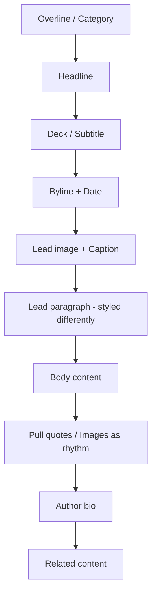

# Editorial Style Specification

> The typography-first aesthetic that signals authority, depth, and craftsmanship. Essential for publications, long-form content, portfolios, and premium brands where content is the product.

---

## 1. Positioning

### 1.1 What This Style Signals

- **Authority**: "We know our subject deeply"
- **Quality**: "We invest in craft"
- **Depth**: "This is worth your time"
- **Premium**: "We respect the reader"
- **Timelessness**: "This isn't trend-chasing"

### 1.2 Best Use Cases

- Digital publications and magazines
- Blogs and long-form content
- Portfolio and case study sites
- Luxury and premium brands
- Cultural institutions (museums, galleries)
- Author and speaker sites
- Documentary and journalism
- Annual reports and white papers

### 1.3 Avoid When

- Primary goal is transactions/conversions
- Users need to take quick actions
- Information density is high
- Target audience prefers scanning
- Content is primarily functional

---

## 2. Color System

### 2.1 Palette Structure

```
┌─────────────────────────────────────────────────────────┐
│  EDITORIAL PALETTE STRUCTURE                            │
├─────────────────────────────────────────────────────────┤
│                                                         │
│  Background ─────── Pure white #FFFFFF or              │
│                     Warm cream #FFFCF7 / #FAF9F6        │
│                     Can use dramatic dark #0A0A0A       │
│                                                         │
│  Text Primary ───── True black #000000 or near-black   │
│                     High contrast is intentional        │
│                                                         │
│  Text Secondary ─── Medium gray #666666 - #737373       │
│                                                         │
│  Accent ─────────── Minimal, often just one color       │
│                     Used for links and highlights only  │
│                     Classic: blue #1a5fff or red #DC2626│
│                                                         │
│  Decorative ─────── Can use color in imagery,           │
│                     pull quotes, or section dividers    │
│                                                         │
└─────────────────────────────────────────────────────────┘
```

### 2.2 Color Philosophy

Editorial style is defined by restraint:

| Element | Color Approach |
|---------|----------------|
| Backgrounds | White, cream, or dramatic black |
| Body text | Pure or near-black (highest contrast) |
| Headlines | Same as body or slightly lighter |
| Links | Single accent color, often blue or brand color |
| Images | Full color, treated as content not decoration |
| Pull quotes | Can use accent color sparingly |

### 2.3 Accent Color Options

Choose ONE:

| Color | Hex | Signal |
|-------|-----|--------|
| Classic Blue | `#1A5FFF` | Traditional, trusted |
| Editorial Red | `#DC2626` | Authoritative, news |
| Deep Green | `#166534` | Nature, sustainability |
| Burgundy | `#7F1D1D` | Premium, wine/food |
| No accent | — | Pure minimalism |

### 2.4 Dark Mode Considerations

Editorial dark mode requires care:

```
Background:   #0A0A0A (not pure black)
Text:         #E5E5E5 (not pure white, reduces strain)
Secondary:    #A3A3A3
Accent:       Lighten 10-20% for contrast
```

---

## 3. Typography

Typography IS the design in editorial style.

### 3.1 Font Selection

**Serif (classic editorial):**
- Georgia (web-safe, proven)
- Freight Text (premium publications)
- Tiempos Text (modern editorial)
- Lora (Google Fonts, elegant)
- Source Serif Pro (versatile)
- Literata (optimized for reading)

**Sans-serif (contemporary editorial):**
- Neue Haas Grotesk (clean authority)
- Söhne (modern sophistication)
- Untitled Sans (neutral elegance)
- Inter (versatile, readable)

**Display (headlines only):**
- Playfair Display (dramatic serif)
- Editorial New (made for this)
- GT Super (bold statements)
- Canela (contemporary classic)

### 3.2 Classic Combinations

| Headline | Body | Character |
|----------|------|-----------|
| Playfair Display | Source Serif Pro | Traditional luxury |
| GT Super | Untitled Sans | Modern premium |
| Canela | Freight Text | Sophisticated |
| Inter Bold | Georgia | Contemporary classic |
| Editorial New | Literata | Digital-native |

### 3.3 Type Scale

Larger scale than other styles, optimized for reading:

| Level | Size | Weight | Line Height | Measure |
|-------|------|--------|-------------|---------|
| Display | 64-96px | 400-700 | 1.0-1.1 | Short |
| H1 | 48px | 700 | 1.15 | Medium |
| H2 | 36px | 700 | 1.2 | — |
| H3 | 28px | 600 | 1.25 | — |
| H4 | 22px | 600 | 1.3 | — |
| Lead | 22px | 400 | 1.5 | 65-75ch |
| Body | 18-20px | 400 | 1.7-1.8 | 65-75ch |
| Caption | 14px | 400 | 1.5 | — |
| Overline | 12px | 500-600 | 1.4 | ALL CAPS |

### 3.4 Optimal Reading Measure

**Critical rule:** Body text should never exceed 75 characters per line.

```css
.article-body {
  max-width: 65ch; /* Optimal: 65-75 characters */
  font-size: 20px;
  line-height: 1.75;
}
```

### 3.5 Typography Rules

- Body text at 18-20px minimum
- Line height 1.7-1.8 for body (very generous)
- Measure: 65-75 characters max
- Paragraph spacing: 1.5-2x line height
- Drop caps acceptable for article openings
- Pull quotes as visual rhythm breaks
- Justified text only if hyphenation is supported

---

## 4. Spacing System

### 4.1 Vertical Rhythm

Editorial uses generous vertical spacing:

```
8px   - Micro (metadata gaps)
16px  - SM (related elements)
24px  - MD (paragraph spacing)
32px  - LG (between paragraphs)
48px  - XL (section breaks)
80px  - 2XL (major sections)
120px - 3XL (hero/chapter breaks)
```

### 4.2 Page Margins

Generous margins are a defining feature:

```
Mobile:     24px margins, content full-width
Tablet:     48px margins, content centered
Desktop:    Content 65ch, centered in viewport
            Or asymmetric with large left margin
Wide:       Max-width 720px body, centered
            Sidebar/notes can extend to 960px
```

### 4.3 Asymmetric Layout

Classic editorial often uses asymmetric margins:

```
┌────────────────────────────────────────────────────────┐
│                                                        │
│  ████████████████████████████████████████              │
│  ████████████████████████████████████████              │
│  ████████████████████████████████████████              │
│  ████████████████████████████████████████              │
│                                                        │
│         ← Large left margin creates elegance →         │
│                                                        │
└────────────────────────────────────────────────────────┘
```

---

## 5. Component Styling

### 5.1 Article Structure



### 5.2 Text Treatments

```css
/* Lead paragraph */
.lead {
  font-size: 22px;
  line-height: 1.6;
  font-weight: 400;
}

/* Drop cap */
.drop-cap::first-letter {
  float: left;
  font-size: 4.5em;
  line-height: 0.8;
  padding-right: 12px;
  font-family: var(--font-display);
}

/* Pull quote */
.pull-quote {
  font-size: 28px;
  font-style: italic;
  border-left: 3px solid var(--accent);
  padding-left: 24px;
  margin: 48px 0;
}

/* Byline */
.byline {
  font-size: 14px;
  text-transform: uppercase;
  letter-spacing: 0.1em;
  color: var(--text-secondary);
}
```

### 5.3 Images

```css
.article-image {
  width: 100%;
  margin: 48px 0;
}
.article-image.bleed {
  width: 100vw;
  margin-left: calc(-50vw + 50%);
}
.image-caption {
  font-size: 14px;
  color: var(--text-secondary);
  margin-top: 12px;
  font-style: italic;
}
```

**Image Rules:**
- Images can break the text column (bleed wider)
- Always include captions
- Credit photographers
- Avoid decorative-only images
- Full-bleed for dramatic impact

### 5.4 Navigation

**Header (minimal):**
- Logo/publication name left
- Minimal navigation
- Search optional
- Height: 56-72px
- Can hide on scroll down, show on scroll up

```css
.nav-editorial {
  display: flex;
  justify-content: space-between;
  align-items: center;
  padding: 16px 24px;
  border-bottom: 1px solid var(--border);
}
.nav-links {
  display: flex;
  gap: 32px;
  font-size: 14px;
  text-transform: uppercase;
  letter-spacing: 0.05em;
}
```

### 5.5 Links

```css
a {
  color: var(--text-primary);
  text-decoration: underline;
  text-decoration-thickness: 1px;
  text-underline-offset: 3px;
}
a:hover {
  color: var(--accent);
}
```

**Link Rules:**
- Underline always visible (accessibility)
- Color change on hover
- No underline removal on hover (maintain clarity)
- Can use accent color for links or keep black

---

## 6. Content Patterns

### 6.1 Article Types

| Type | Characteristics |
|------|-----------------|
| Feature | Large hero, dramatic typography, immersive |
| News | Dense, quick-scan, timestamp prominent |
| Essay | Author-focused, minimal imagery |
| Profile | Subject imagery dominant, pull quotes |
| List/Roundup | Numbered sections, scannable |
| Visual essay | Image-led, minimal text |

### 6.2 Homepage/Index Layout

```
┌─────────────────────────────────────────────────────────┐
│  PUBLICATION NAME                               Menu   │
├─────────────────────────────────────────────────────────┤
│                                                         │
│  ┌─────────────────────────────────────────────────┐   │
│  │  FEATURED STORY                                 │   │
│  │  Large hero image                               │   │
│  │  Dramatic headline                              │   │
│  │  Deck text                                      │   │
│  └─────────────────────────────────────────────────┘   │
│                                                         │
│  ┌──────────────┐  ┌──────────────┐  ┌──────────────┐  │
│  │ Story 2      │  │ Story 3      │  │ Story 4      │  │
│  │ Image        │  │ Image        │  │ Image        │  │
│  │ Headline     │  │ Headline     │  │ Headline     │  │
│  └──────────────┘  └──────────────┘  └──────────────┘  │
│                                                         │
│  SECTION HEADER ─────────────────────────────────────  │
│                                                         │
│  Story list with thumbnails...                         │
│                                                         │
└─────────────────────────────────────────────────────────┘
```

### 6.3 Footnotes and Asides

```css
.footnote {
  font-size: 14px;
  color: var(--text-secondary);
}
.sidenote {
  float: right;
  width: 200px;
  margin-left: 24px;
  font-size: 14px;
  color: var(--text-secondary);
}
```

---

## 7. Interaction Patterns

### 7.1 Animation Philosophy

Minimal, purposeful animation:

- **Page transitions**: Subtle fades
- **Scroll**: Parallax on hero images (optional)
- **Reading progress**: Subtle indicator
- **Menu**: Simple slide or fade

### 7.2 Reading Experience

```css
/* Progress indicator */
.reading-progress {
  position: fixed;
  top: 0;
  left: 0;
  height: 2px;
  background: var(--accent);
  width: var(--progress);
  z-index: 100;
}

/* Estimated read time */
.read-time {
  font-size: 14px;
  color: var(--text-secondary);
}
```

### 7.3 Interactive Elements

| Element | Treatment |
|---------|-----------|
| Share buttons | Minimal, often hidden until hover |
| Comments | Separated from article |
| Related content | Below article, not sidebar |
| Newsletter signup | After article or sticky footer |

---

## 8. Special Elements

### 8.1 Pull Quotes

```
         ──────────────────────────────
         
         "The best typography is invisible.
          The reader should not notice it,
          only experience it."
         
         ──────────────────────────────
```

### 8.2 Section Dividers

- Simple horizontal rules
- Extra whitespace
- Ornamental characters (✦, ◆, —)
- Number markers for numbered sections

### 8.3 Data in Editorial

When including data:

- Inline statistics styled distinctively
- Charts should be clean, minimal
- Tables with generous padding
- Infographics as full-width breaks

---

## 9. Do's and Don'ts

### Do's ✓

- Prioritize readability above all
- Use generous whitespace
- Respect the measure (line length)
- Include proper metadata (date, author, time)
- Use high-quality imagery
- Create clear content hierarchy
- Allow for long-form engagement
- Include proper attribution

### Don'ts ✗

- Cram content into tight columns
- Use small body text (<18px)
- Add decorative UI elements
- Interrupt reading with CTAs
- Use aggressive advertising placement
- Sacrifice readability for style
- Neglect captions and credits
- Ignore dark mode for long-form reading

---

## 10. Reference Sites

| Site | Notable Elements |
|------|------------------|
| nytimes.com | Section hierarchy, typography |
| newyorker.com | Classic editorial, illustration |
| medium.com | Clean reading experience |
| theverge.com | Modern editorial, bold choices |
| stripe.com/blog | Tech editorial |
| aeon.co | Long-form, immersive |
| longreads.com | Curated long-form |
| craigmod.com | Personal editorial |

---

## 11. Implementation Checklist

- [ ] Body text is 18-20px
- [ ] Line length limited to 65-75 characters
- [ ] Line height is 1.7+ for body
- [ ] Generous margins on all sides
- [ ] Headlines create clear hierarchy
- [ ] Images have captions
- [ ] Byline and date are visible
- [ ] Links are clearly identifiable
- [ ] Reading experience is uninterrupted
- [ ] Dark mode maintains readability
- [ ] Responsive without breaking reading flow

---

*Version: 0.1.0*
*Last updated: 2026-01-29*
