# Text-Based Wireframe Languages Reference

> This document specifies the text-based wireframe formats available for rapid UI mockup generation. These formats are **LLM-native**: minimal tokens, version-control friendly, and directly generatable from natural language prompts.

---

## 1. Overview

Text-based wireframe languages enable designers and agents to generate, iterate, and version-control UI mockups using plain text. Unlike visual tools (Balsamiq, Figma), these formats:

- **Consume minimal tokens** - ASCII uses ~10× fewer tokens than HTML prototypes
- **Integrate with git** - Diff, blame, and merge operations work natively
- **Embed in documentation** - Wireframes live alongside markdown specs
- **Generate directly from prompts** - No export/import steps

### 1.1 Format Selection Matrix

| Format | Token Efficiency | Visual Fidelity | Tooling Required | Best For |
|--------|------------------|-----------------|------------------|----------|
| **ASCII Wireframes** | Excellent (~30-60 tokens/screen) | Low | None | Rapid iteration, early ideation |
| **PlantUML Salt** | Good (~200-300 tokens/screen) | Low-Mid | PlantUML renderer | Documentation, form-heavy UIs |
| **Wireweave DSL** | Good (~150-200 tokens/screen) | Mid | NPM package, VSCode | Team collaboration, rendered previews |
| **Mermaid** | Excellent | N/A (flows only) | Built into many renderers | User flows, state diagrams, site maps |

### 1.2 When to Use Each

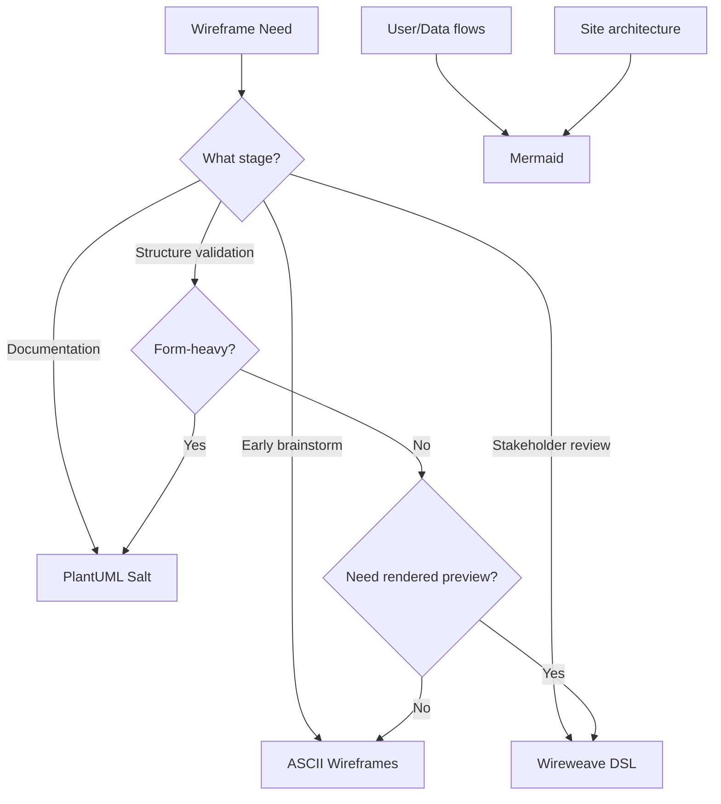

---

## 2. ASCII Wireframes

The simplest approach: Unicode box-drawing characters and spacing to sketch layouts in plain text.

### 2.1 Character Set

**Box drawing:**
```
┌ ┐ └ ┘  - Corners
─ │      - Lines
├ ┤ ┬ ┴  - T-junctions  
┼        - Cross
═ ║      - Double lines (emphasis)
```

**Component conventions:**
```
[Button Text]     - Buttons
[X] Checked       - Checkbox checked
[ ] Unchecked     - Checkbox unchecked
(X) Selected      - Radio selected
( ) Unselected    - Radio unselected
"Input text"      - Text input
^Dropdown^        - Select/dropdown
[====    ]        - Progress bar
< > arrows        - Navigation
```

### 2.2 Layout Patterns

**Basic page structure:**
```
┌─────────────────────────────────────────┐
│                 HEADER                  │
├─────────────────────────────────────────┤
│         │                               │
│ SIDEBAR │        MAIN CONTENT           │
│         │                               │
│         │                               │
├─────────────────────────────────────────┤
│                 FOOTER                  │
└─────────────────────────────────────────┘
```

**Card grid:**
```
┌──────────┐  ┌──────────┐  ┌──────────┐
│  Card 1  │  │  Card 2  │  │  Card 3  │
│          │  │          │  │          │
│  [CTA]   │  │  [CTA]   │  │  [CTA]   │
└──────────┘  └──────────┘  └──────────┘
```

**Form layout:**
```
┌─────────────────────────────────────┐
│           Create Account            │
├─────────────────────────────────────┤
│  Name:     [                    ]   │
│  Email:    [                    ]   │
│  Password: [                    ]   │
│                                     │
│  [X] I agree to terms               │
│                                     │
│  [  Cancel  ]    [ Create Account ] │
└─────────────────────────────────────┘
```

**Navigation:**
```
┌─────────────────────────────────────────┐
│ ☰  Logo          Home | About | Contact │
└─────────────────────────────────────────┘

┌─────────────────────────────────────────┐
│  < Back    Page Title         [Action]  │
└─────────────────────────────────────────┘
```

### 2.3 Complete Page Example

```
┌─────────────────────────────────────────────────┐
│  Logo                    Home | Pricing | Login │
├─────────────────────────────────────────────────┤
│                                                 │
│         Stop Wasting Time on [Pain]             │
│                                                 │
│    Subheadline explaining the value prop        │
│                                                 │
│    [  Enter email  ] [ Get Early Access ]       │
│                                                 │
│         "2,547 people on the waitlist"          │
│                                                 │
├─────────────────────────────────────────────────┤
│                                                 │
│  ┌─────────────┐ ┌─────────────┐ ┌───────────┐  │
│  │   Benefit   │ │   Benefit   │ │  Benefit  │  │
│  │     One     │ │     Two     │ │   Three   │  │
│  │             │ │             │ │           │  │
│  │ Description │ │ Description │ │Description│  │
│  └─────────────┘ └─────────────┘ └───────────┘  │
│                                                 │
├─────────────────────────────────────────────────┤
│                                                 │
│  "Testimonial quote from happy customer..."     │
│                                                 │
│            — Name, Title @ Company              │
│                                                 │
├─────────────────────────────────────────────────┤
│                                                 │
│          [ Start My Free Trial ]                │
│                                                 │
├─────────────────────────────────────────────────┤
│   © 2026 Company  |  Privacy  |  Terms          │
└─────────────────────────────────────────────────┘
```

### 2.4 ASCII Best Practices

- **Consistent widths** - Keep boxes aligned within sections
- **Clear hierarchy** - Use double lines `═` for major divisions
- **Annotate** - Add comments below for interaction notes
- **Keep simple** - ASCII is for structure, not detail
- **Name components** - Label interactive elements clearly

### 2.5 Tools

- **Bare Minimum** - AI-powered ASCII generator with drag-and-drop
- **AsciiKit** - Pre-written prompts for Claude/GPT
- **Direct LLM generation** - No tools required; prompt directly

---

## 3. PlantUML Salt

Salt is a wireframing sublanguage within PlantUML, mature and well-documented.

### 3.1 Basic Syntax

```plantuml
@startsalt
{
  Content here
}
@endsalt
```

### 3.2 Component Reference

**Buttons:**
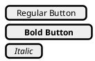

**Form inputs:**
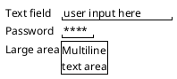

**Checkboxes and radios:**
```plantuml
@startsalt
{
  [X] Checked checkbox
  [ ] Unchecked checkbox
  (X) Selected radio
  ( ) Unselected radio
}
@endsalt
```

**Dropdowns:**
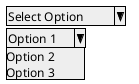

**Tabs:**
```plantuml
@startsalt
{
  {/ <b>Tab 1 | Tab 2 | Tab 3 }
  Content for selected tab
}
@endsalt
```

**Tables/Grids:**
```plantuml
@startsalt
{#
  Name | Email | Role
  John | john@co.com | Admin
  Jane | jane@co.com | User
}
@endsalt
```

Grid modifiers:
- `{#` - All grid lines
- `{!` - Vertical lines only
- `{-` - Horizontal lines only
- `{+` - External border only

**Trees:**
```plantuml
@startsalt
{
  {T
    + Root
    ++ Child 1
    +++ Grandchild
    ++ Child 2
  }
}
@endsalt
```

**Separators:**
```plantuml
@startsalt
{
  Content above
  --
  Thin separator
  ==
  Thick separator
  ..
  Dotted separator
}
@endsalt
```

### 3.3 Layout Patterns

**Two-column layout:**
```plantuml
@startsalt
{
  {
    Sidebar content | Main content area
  }
}
@endsalt
```

**Form with labels:**
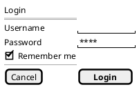

**Dashboard card:**
```plantuml
@startsalt
{+
  <b>Revenue
  --
  $45,231
  <color:green>↑ 12%</color>
}
@endsalt
```

### 3.4 Complete Page Example

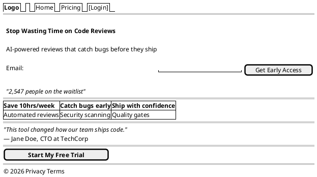

### 3.5 Advanced Features

**Reusable components with macros:**
```plantuml
@startsalt
!define BUTTON(text) [text]
!define INPUT(label) label | "          "

{
  INPUT(Email)
  INPUT(Password)
  BUTTON(**Login**)
}
@endsalt
```

**Conditional display:**
```plantuml
@startsalt
!$logged_in = true

{
  !if ($logged_in)
    Welcome back! | [Logout]
  !else
    [Login] | [Sign Up]
  !endif
}
@endsalt
```

### 3.6 Tools & Rendering

- **PlantUML CLI** - `java -jar plantuml.jar file.puml`
- **PlantUML Web Server** - paste and render online
- **IDE plugins** - VSCode, IntelliJ, Eclipse
- **Markdown integration** - GitLab renders natively

**Output formats:** PNG, SVG, ASCII (text-only fallback)

---

## 4. Wireweave DSL

Modern, LLM-optimized wireframe language with native MCP support.

### 4.1 Basic Structure

```wireweave
page "Page Name" width=1200 height=800 {
  // Components here
}
```

### 4.2 Layout Containers

**Row (horizontal):**
```wireweave
row gap=4 justify=between align=center {
  // Children laid out horizontally
}
```

**Column (vertical):**
```wireweave
col gap=4 align=center {
  // Children laid out vertically
}
```

**Card:**
```wireweave
card p=4 {
  // Card content
}
```

**Section:**
```wireweave
section hero p=8 {
  // Section with semantic name
}
```

### 4.3 Component Reference

**Text elements:**
```wireweave
title "Heading Text" level=1    // h1
title "Subheading" level=2      // h2
text "Body text"
text "Muted text" muted
text "Small text" size=sm
```

**Interactive elements:**
```wireweave
button "Click Me"
button "Primary" variant=primary
button "Danger" variant=danger
input placeholder="Enter email"
input placeholder="Password" type=password
```

**Media & data:**
```wireweave
avatar "JD"                     // Initials avatar
avatar src="url" size=lg        // Image avatar
badge "New" variant=success
placeholder w=200 h=150         // Image placeholder
```

**Navigation:**
```wireweave
nav vertical {
  item "Dashboard" active
  item "Settings"
  item "Logout"
}
```

### 4.4 Styling Properties

**Spacing:**
- `p=4` - Padding (all sides)
- `px=4` - Horizontal padding
- `py=4` - Vertical padding
- `m=4` - Margin
- `gap=4` - Gap between children

**Layout:**
- `w=200` - Width
- `h=100` - Height
- `justify=between` - Justify content (start, center, end, between, around)
- `align=center` - Align items (start, center, end)

**Variants:**
- `variant=primary` - Primary styling
- `variant=secondary` - Secondary styling
- `variant=success` - Success/positive
- `variant=danger` - Error/destructive

### 4.5 Complete Page Example

```wireweave
page "Landing Page" width=1200 {
  header p=4 {
    row justify=between align=center {
      text "Logo" bold
      nav horizontal {
        item "Home"
        item "Pricing"
        item "About"
      }
      button "Get Started" variant=primary
    }
  }
  
  section hero p=8 {
    col align=center gap=6 {
      title "Stop Wasting Time on Code Reviews" level=1
      text "AI-powered reviews that catch bugs before they ship" muted
      
      row gap=2 {
        input placeholder="Enter your email" w=300
        button "Get Early Access" variant=primary
      }
      
      text "2,547 people on the waitlist" size=sm muted
    }
  }
  
  section benefits p=6 {
    row gap=6 justify=center {
      card p=4 {
        col gap=2 align=center {
          title "Save 10hrs/week" level=3
          text "Automated reviews free up your time" muted
        }
      }
      card p=4 {
        col gap=2 align=center {
          title "Catch bugs early" level=3
          text "Security scanning on every PR" muted
        }
      }
      card p=4 {
        col gap=2 align=center {
          title "Ship with confidence" level=3
          text "Quality gates that protect production" muted
        }
      }
    }
  }
  
  section testimonial p=6 {
    col align=center gap=2 {
      text "\"This tool changed how our team ships code.\"" italic
      row gap=2 align=center {
        avatar "JD"
        col {
          text "Jane Doe" bold
          text "CTO at TechCorp" muted size=sm
        }
      }
    }
  }
  
  section cta p=6 {
    col align=center {
      button "Start My Free Trial" variant=primary size=lg
    }
  }
  
  footer p=4 {
    row justify=center gap=4 {
      text "© 2026" muted
      text "Privacy" muted
      text "Terms" muted
    }
  }
}
```

### 4.6 Tools & Integration

**NPM package:**
```bash
npm install @wireweave/core
```

**VSCode extension:** `wireweave.wireweave-vscode`
- Syntax highlighting
- Live preview
- Error checking

**MCP Server:** Native Claude/GPT integration
- `wireweave_render_html` - Generate HTML from DSL
- `wireweave_validate` - Check syntax
- `wireweave_grammar` - Get grammar reference

**Output formats:** HTML, SVG, interactive preview

---

## 5. Mermaid (Flows & Architecture)

Mermaid is not a wireframe language but essential for user flows, state diagrams, and site architecture.

### 5.1 User Flow Diagrams

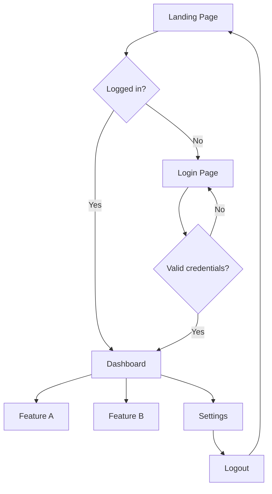

### 5.2 State Diagrams

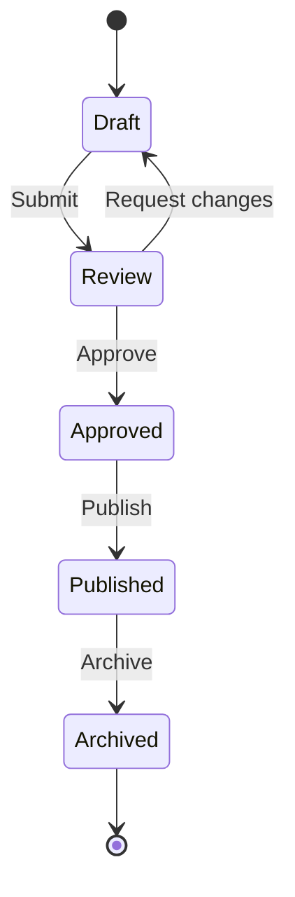

### 5.3 Site Maps

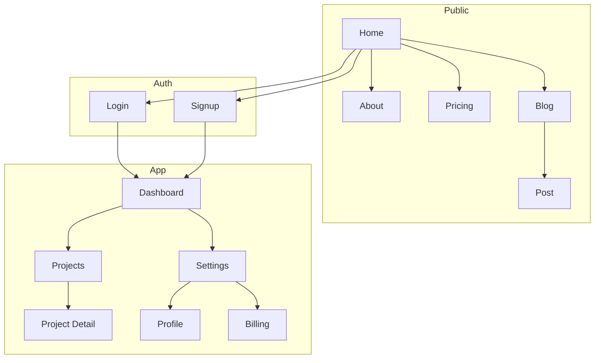

### 5.4 Sequence Diagrams (Interactions)

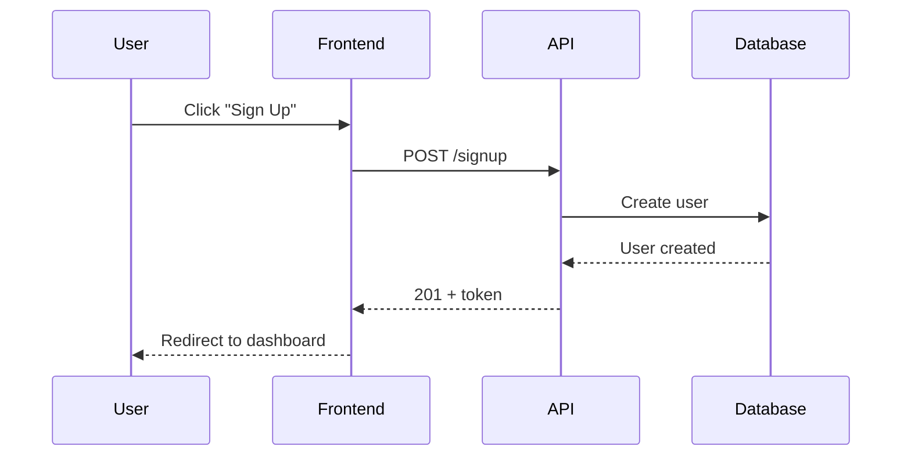

---

## 6. Conversion Between Formats

### 6.1 ASCII → PlantUML Salt

Manual conversion pattern:
```
ASCII:                          PlantUML Salt:
┌────────────┐                  @startsalt
│  Header    │                  {
├────────────┤         →        Header
│  Content   │                  ==
└────────────┘                  Content
                                }
                                @endsalt
```

### 6.2 ASCII → Wireweave

```
ASCII:                          Wireweave:
┌────────────┐                  page "Page" {
│  [Button]  │         →          button "Button"
│  Input: __ │                    input placeholder="Input"
└────────────┘                  }
```

### 6.3 LLM-Assisted Conversion

Prompt pattern:
```
Convert this ASCII wireframe to [PlantUML Salt / Wireweave DSL]:

[paste ASCII]

Maintain the same structure and component types.
```

---

## 7. Integration with Design Workflow

### 7.1 Recommended Progression

```mermaid
flowchart LR
    A[Requirements] --> B[ASCII Sketch]
    B --> C{Direction Approved?}
    C -->|No| B
    C -->|Yes| D[PlantUML/Wireweave]
    D --> E{Structure Approved?}
    E -->|No| D
    E -->|Yes| F[SVG Hi-Fi Mockup]
    F --> G[Production Code]
```

### 7.2 Version Control Strategy

```
project/
├── docs/
│   └── wireframes/
│       ├── landing-v1.ascii      # Initial brainstorm
│       ├── landing-v2.ww         # Refined structure
│       └── user-flow.mermaid     # Flow diagram
├── src/
│   └── pages/
│       └── landing.tsx           # Implementation
```

**Git workflow:**
- Wireframes committed alongside code changes
- PR reviews include wireframe diffs
- Design decisions documented in commit messages

### 7.3 Token Budget Comparison

For a typical login screen:

| Format | Approximate Tokens |
|--------|-------------------|
| HTML/CSS | 800-1200 |
| Wireweave | 150-200 |
| PlantUML Salt | 200-300 |
| ASCII | 30-60 |

ASCII enables including entire wireframe sets in LLM context without consuming excessive space.

---

## References

- Wireweave: https://wireweave.org
- PlantUML Salt: https://plantuml.com/salt
- Mermaid: https://mermaid.js.org
- AsciiKit: https://asciikit.com

---

*Version: 0.1.0*
*Last updated: 2026-01-29*
