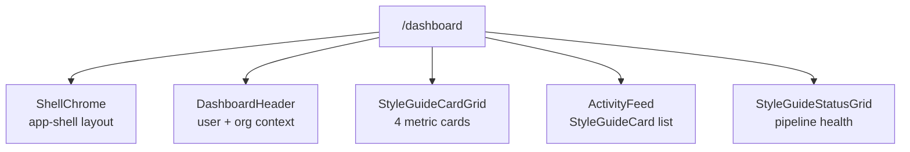

# Engine Style Guide Output

> Converts a completed markdown style guide into YAML config files for the styleguide-engine, producing an interactive HTML design system with theme switching, dark mode, and live components.

---

## 1. Overview

The styleguide-engine is a Next.js 15 static-export app that generates interactive HTML style guides from YAML configuration. It features:

- **4-pass defaults cascade:** 12 seed values expand to ~300 CSS custom properties
- **Theme inheritance:** child themes only override what they change
- **Per-theme CSS scoping** via `html[data-design-theme="{slug}"]`
- **Live component previews**, color mode switching, typography specimens

This document is the primary integration path between the UX Engineer skill and the engine. It replaces standalone HTML template generation.

> **New to the engine?** Start with [styleguide-setup-guide.md](styleguide-setup-guide.md) for end-to-end setup instructions, workflow selection (engine viewer vs project-local), and the codefre.sh reference implementation. This document covers YAML extraction from a completed markdown style guide.

> **CRITICAL — Theme Hosting Rules:**
>
> Themes are **NEVER** manually copied or symlinked into `styleguide-engine/app/src/config/`. There are exactly two supported workflows:
>
> | Workflow | Theme YAML lives at | How it runs | When to use |
> |----------|-------------------|-------------|-------------|
> | **A: Engine Viewer** | `projects/{domain}/design/theme/theme-{slug}/` | `./serve-project.sh {domain}` (auto-symlinks) | Design exploration, no project frontend yet |
> | **B: Project-Local** | `projects/{domain}/app/frontend/src/config/theme-{slug}/` | `npm run dev` inside the project frontend | Project has its own Next.js app (e.g., codefre.sh) |
>
> `serve-project.sh` manages symlinks automatically — you never touch the engine's `src/config/` directory. For Workflow B, the project imports `@the-robot-lives/styleguide` as an npm dependency and generates CSS locally. See [styleguide-setup-guide.md](styleguide-setup-guide.md) for full details.

---

## 2. Scaffolding a New Project

### 2.1 From the starter tarball (recommended)

A pre-built starter is available as a skill asset. Extract it into the target project:

```bash
# From the repo root:
mkdir -p projects/{name}/web
tar xzf skills/user-experience-engineer/assets/styleguide-starter.tar.gz \
  -C projects/{name}/web

cd projects/{name}/web
```

Or if copying from the live starter directory:

```bash
cp -r styleguide-starter projects/{name}/web
cd projects/{name}/web
```

### 2.2 Install and verify

The starter requires a `.npmrc` pointing at the Verdaccio registry (`npm.noizu.com`):

```bash
npm install
npm run regen    # Generate CSS from base theme
npm run dev      # Start dev server → http://localhost:3000
```

Verify:
- `/` — landing page with design token components
- `/styleguide` — full interactive style guide viewer

### 2.3 What the starter contains

```
projects/{name}/web/
  .npmrc                           # Verdaccio registry config
  package.json                     # @noizu/styleguide dependency
  next.config.ts                   # webpack alias for @styleguide-engine/
  tsconfig.json                    # paths for @/ and @styleguide-engine/
  regen.sh                         # Convenience: rm cache + regenerate CSS
  src/
    app/
      layout.tsx                   # Root layout with data-design-theme
      page.tsx                     # Your landing page (customize this)
      globals.css                  # Imports tailwind + generated CSS
      styleguide/
        page.tsx                   # Full style guide viewer (works out of box)
      design-system.generated.css  # Generated by regen (gitignored)
    config/
      theme-style-guide/           # Base theme (provides cascade defaults)
        branding.yaml
        style-guide.meta.yaml
        style-guide.vars.yaml
        ... (20 YAML facets)
    scripts/
      generate-css.ts              # Calls engine's CSS generation
  public/
    themes/                        # Per-theme CSS files (generated)
```

---

## 3. Customizing the Style Guide

### 3.1 Edit the existing theme

The scaffold ships with a single `theme-style-guide/` directory containing placeholder content. **Edit these files in place** — do not create a new `theme-*` directory.

At minimum, update these 3 files:

**`style-guide.meta.yaml`** — project identity:
```yaml
name: "{Project Name}"
slug: "{slug}"
title: "{Project Name} — Style Guide"
description: "{one-line description}"
```

**`style-guide.vars.yaml`** — design token seeds (see §5.3 below)

**`branding.yaml`** — brand identity, logo, intro hero (see §5.2 below)

The remaining YAML files (`color-palette`, `typography`, `color-modes`, `css-snippets`, `scoped-vars`, `semantic-classes`, `page-layouts`, `shell-layouts`, `glyphs`, etc.) all have placeholder content with documentation comments — edit them to match your `design/style-guide.md`.

**Important:** When you change the `slug` in `style-guide.meta.yaml`, also update the CSS selectors in `style-guide.css-snippets.yaml` and `style-guide.scoped-vars.yaml` from `html[data-design-theme="style-guide"]` to `html[data-design-theme="{slug}"]`.

### 3.2 Regenerate CSS

```bash
npm run regen
```

This discovers all `theme-*` directories, generates scoped CSS for each, and writes:
- `src/app/design-system.generated.css` — composite CSS (all themes)
- `public/themes/{slug}.css` — per-theme CSS files

### 3.3 Set the active theme

In `src/app/layout.tsx`, set the `data-design-theme` attribute to match the slug in your `style-guide.meta.yaml`:

```tsx
<html lang="en" data-design-theme="{slug}">
```

### 3.4 Multiple design directions (optional)

To compare design directions side-by-side, create additional `theme-*` directories alongside the edited base:

```
src/config/
  theme-style-guide/           # your project theme (edited in place)
  theme-{project}-alt/         # alternate direction for comparison
```

Each shows up in the `/styleguide` theme picker. This is optional — most projects only need one theme.

### 3.5 Build your pages

Import components from the package:

```tsx
// Primitives — low-level design-token-driven building blocks
import { StyleGuideBtn, StyleGuideCard, StyleGuideCardGrid } from "@noizu/styleguide/primitives";

// Showcases — full-section demos for the style guide viewer
import { ButtonShowcase, TypographyShowcase } from "@noizu/styleguide/showcases";

// Layout — page chrome, section orchestration, theme infrastructure
import { LayoutBar, ThemeAwareSections, PageContent } from "@noizu/styleguide/layout";

// Providers — React context for theme config and semantic selection
import { ThemeConfigProvider, useThemeConfig } from "@noizu/styleguide/providers";

// Viewers — inspect generated CSS and YAML config
import { CssViewer, YamlConfigViewer } from "@noizu/styleguide/viewers";

// Demos — interactive form field demos
import { CheckboxRadioDemo, ToastsDemo } from "@noizu/styleguide/demos";

// Sections — runtime section registry
import { sectionRegistry } from "@noizu/styleguide/sections";

// CSS generation — for build scripts and server components
import { loadConfig, generateCSSSections } from "@noizu/styleguide/css-gen";

// Types
import type { StyleGuideConfig } from "@noizu/styleguide/types";

// Backward-compatible catch-all (imports everything — no tree-shaking)
// import { StyleGuideBtn, ButtonShowcase } from "@noizu/styleguide/components";  // primitives only
// import { ThemeConfigProvider, CssViewer } from "@noizu/styleguide/viewer";     // all viewer groups
```

All components consume CSS custom properties from the generated CSS. They work automatically once a theme is active.

### 3.6 The style guide page

The `/styleguide` route (`src/app/styleguide/page.tsx`) renders the full interactive viewer — the same one the engine uses. It:
- Loads all theme configs at build time (server component)
- Renders showcases for every design system section
- Supports theme switching, color mode toggle, section search
- Works out of the box with any themes in `src/config/`

Customize it by editing the page or by adding YAML config (e.g., `style-guide.page-sections.yaml` controls which sections appear).

### 3.7 The site map page

The `/sitemap` route (`src/app/sitemap/page.tsx`) renders a site flow overview:
- **Mermaid flow diagram** showing page hierarchy and component tree
- **Page inventory table** with routes, purposes, and key components
- **Style guide section list** grouped by category (visual foundation, structure, interaction, reference)
- **Theme list** showing all discovered themes and which is active

When adding pages to your project, update the sitemap page with:
1. A new row in the page inventory table
2. A new node in the mermaid flow diagram
3. The key components used on that page

**Example: adding a `/dashboard` page**

Update the mermaid diagram in `src/app/sitemap/page.tsx`:
```
ROOT -->|data-design-theme| DASH["/dashboard  Dashboard"]
DASH --- DASH_SHELL["ShellChrome (sidebar nav)"]
DASH --- DASH_CARDS["Metric Cards: StyleGuideCardGrid"]
DASH --- DASH_STATUS["StatusGrid: pipeline status"]
```

### 3.8 Sitemap-first development (REQUIRED)

**Before building any new page, the sitemap must be updated first.** This is not optional — it is the primary planning artifact for the project's information architecture.

The sitemap exists in two forms:
1. **`design/SITEMAP.md`** — the markdown design artifact (created during the md stage, see `outputs/sitemap.md`)
2. **`src/app/sitemap/page.tsx`** — the rendered TSX (populated from the markdown during implementation)

The markdown version is the source of truth during design. The TSX version is generated from it.

The workflow is:

1. **Plan in `design/SITEMAP.md`** — Add the new page to the page flow diagram, the page inventory table, and create a per-page section diagram showing its component tree
2. **Review the sitemap markdown** — Verify the page makes sense in the navigation hierarchy, doesn't duplicate existing pages, and its components are appropriate
3. **Update `/sitemap/page.tsx`** — Translate the markdown changes into the TSX (see `outputs/sitemap.md` §5 for the mapping)
4. **Then build the page** — Implement what the sitemap describes

#### What the sitemap must contain for each page

**Page flow diagram** — a node in the top-level `graph LR` showing the route and how it connects to other pages:
```
ROOT -->|data-design-theme| DASH["/dashboard"]
```

**Per-page section diagram** — a dedicated `graph TD` showing the page's internal structure:


Each node should name:
- The **component** being used (from `@noizu/styleguide` or custom)
- A brief **description** of what it renders in this context
- **Nesting** that reflects the actual component hierarchy

**Page inventory row** — a row in the spec-table:
```
| /dashboard | Project dashboard | ShellChrome, StyleGuideCardGrid, StyleGuideStatusGrid |
```

#### Why sitemap-first matters

- Forces you to think about information architecture before implementation
- Reveals missing components or data dependencies early
- Creates a contract between design and implementation — the diagram IS the spec
- Keeps the project navigable as it grows — new contributors read the sitemap first
- The UX Engineer skill uses the sitemap to understand what exists before proposing changes

#### When the agent creates pages

When the UX Engineer skill is asked to build a new page or feature:

1. Read `design/SITEMAP.md` first to understand current site architecture
2. Update `design/SITEMAP.md` with the proposed page (flow diagram + component tree + inventory row)
3. Present the updated sitemap markdown for review
4. Only after approval, translate changes to `src/app/sitemap/page.tsx`
5. Then create the actual page files
6. If the page changes during implementation, update both the markdown and TSX sitemap to match

The `design/SITEMAP.md` is the source of truth for "what pages exist and what they contain." The TSX sitemap page and the actual page code must both match it. See `outputs/sitemap.md` for the full format specification.

---

## 4. Prerequisites

- A completed markdown style guide (sections §00-§12) OR willingness to iterate directly in YAML
- `.npmrc` configured for Verdaccio (`npm.noizu.com`) — see §2.2
- Node 22+, npm

---

## 5. Section-to-YAML Mapping

| Skill Section | Engine YAML Facet | Required? |
|---|---|---|
| SS00 Header & Brand Identity | `branding.yaml` | YES |
| SS00 (meta) | `style-guide.meta.yaml` | YES |
| SS01 Design Tokens | `style-guide.vars.yaml` | YES |
| SS02 Color Palette | `style-guide.color-palette.yaml` | No |
| SS02 (modes) | `style-guide.color-modes.yaml` | YES |
| SS03 Typography | `style-guide.typography.yaml` | No |
| SS04 Spacing & Layout | `style-guide.spacing.yaml` | No |
| SS04 (layouts) | `style-guide.page-layouts.yaml` | No |
| SS05-06 Buttons + Inputs | `style-guide.css-snippets.yaml` | No |
| SS07 Navigation (shell) | `style-guide.shell-layouts.yaml` | No |
| SS08 Status Indicators | `style-guide.semantic-classes.yaml` | No |

The first 3 files plus `style-guide.color-modes.yaml` are required. The engine's base theme (`theme-style-guide`) fills in defaults for everything else via inheritance.

**Color modes are not optional.** Every theme must define distinct `light` and `dark` values in both `style-guide.color-modes.yaml` and `style-guide.scoped-vars.yaml`. If the design style strongly warrants a single mode (e.g., a Nocturne theme that is inherently dark), you may set both modes to the same values — but this is the exception, not the default. Most projects should have a real light mode with inverted surfaces, adjusted text contrast, and accent colors darkened for legibility on light backgrounds.

---

## 6. YAML Templates

Each subsection provides the exact schema, field mappings from the markdown style guide, and a minimal example.

### 6.1 style-guide.meta.yaml (from SS00)

```yaml
name: {project-name}          # Human-readable name
slug: {project-slug}          # URL-safe identifier, becomes data-design-theme value
title: "{Project Title}"      # Display title in viewer
description: "{one-liner}"    # Brief description
base-theme: "theme-style-guide"  # Always inherit from base unless chaining themes
```

### 6.2 branding.yaml (from SS00)

```yaml
name: {project-name}
logo-text: "{PROJECT NAME}"   # Uppercase display name
intent: "{what the designer does}"          # From SS00 Brand Identity > Style Intent
perception: "{what the user feels}"         # From SS00 Brand Identity > Desired Perception
audience: "{who it's for}"                  # From SS00 Brand Identity > Target Audience
tone: "{voice/personality}"                 # From SS00 Brand Identity > Tone / Voice
keywords:                                    # From SS00 Brand Identity > Brand Keywords
  - keyword1
  - keyword2
  - keyword3
```

### 6.3 style-guide.vars.yaml (from SS01)

This is the most important file. Extract CSS custom properties from the SS01 Design Tokens code block and organize into named groups.

```yaml
vars:
  groups:
    - name: "Seed Colors"
      vars:
        white: "#ffffff"       # Map from --white or lightest neutral
        black: "#1a1a1a"       # Map from --black or darkest neutral
        red: "#e20613"         # Map from primary accent color
        blue: "#0047ab"        # Map from secondary accent or info color
        yellow: "#f5a623"      # Map from tertiary accent or warning color

    - name: "Semantic Colors"
      vars:
        success: "#22c55e"     # From --success
        warning: "#eab308"     # From --warning
        error: "#ef4444"       # From --error
        info: "#3b82f6"        # From --info

    - name: "Typography"
      vars:
        font-sans: "'Inter', -apple-system, BlinkMacSystemFont, sans-serif"   # From --font-sans
        font-mono: "'JetBrains Mono', 'Menlo', monospace"                      # From --font-mono

    - name: "Shape"
      vars:
        radius: "2px"          # From --radius
```

**Seed-to-cascade mapping:** The engine computes ~300 tokens from these seeds:

- `white` + `black` --> full gray ramp (gray-50 through gray-900)
- `red`, `blue`, `yellow` --> light/mid transparency variants
- `success`, `warning`, `error`, `info` --> semantic backgrounds
- `font-sans`, `font-mono` --> typography system
- `radius` --> all border-radius values

**If the markdown uses different token names**, map them:

| Markdown Token | Engine Seed |
|---|---|
| `--bg-primary`, `--bg-base` | Computed from `white`/`black` |
| `--accent`, `--primary` | Map to `red` or `blue` (whichever is the primary accent) |
| `--font-body`, `--font-heading` | Both go in `font-sans` unless heading uses a different family |

### 6.4 style-guide.color-palette.yaml (from SS02)

```yaml
color-palette:
  - group: "Primary Colors"
    colors:
      - name: "Red"
        hex: "#e20613"
      - name: "Blue"
        hex: "#0047ab"
    notes:
      - "Red is the primary action color -- use for CTAs and destructive actions"
      - "Blue is for informational and navigational elements"

  - group: "Neutral Scale"
    colors:
      - name: "White"
        hex: "#ffffff"
      - name: "Gray 50"
        hex: "#fafafa"
      # ... through gray-900
      - name: "Black"
        hex: "#1a1a1a"

  - group: "Semantic"
    colors:
      - name: "Success"
        hex: "#22c55e"
      - name: "Warning"
        hex: "#eab308"
      - name: "Error"
        hex: "#ef4444"
      - name: "Info"
        hex: "#3b82f6"
```

### 6.5 style-guide.typography.yaml (from SS03)

```yaml
typography:
  - family: "Inter"
    var: "--font-sans"
    weights: [400, 500, 600, 700]
    description: "Primary typeface for body text and UI elements"

  - family: "JetBrains Mono"
    var: "--font-mono"
    weights: [400, 500]
    description: "Code and technical content"

typography-classes:
  - name: "Display"
    size: "var(--font-size-display)"
    weight: 700
    family: "var(--font-sans)"
    line-height: 1.1
    usage: "Hero headlines, landing page titles"

  - name: "Heading 1"
    size: "var(--font-size-3xl)"
    weight: 700
    family: "var(--font-sans)"
    line-height: 1.2
    usage: "Page titles"

  - name: "Body"
    size: "var(--font-size-base)"
    weight: 400
    family: "var(--font-sans)"
    line-height: 1.6
    usage: "Paragraph text, descriptions"

  - name: "Code"
    size: "var(--font-size-sm)"
    weight: 400
    family: "var(--font-mono)"
    line-height: 1.5
    usage: "Code blocks, terminal output"
```

### 6.6 style-guide.spacing.yaml (from SS04)

```yaml
spacing-contexts:
  grid:
    columns: 12
    gutter-token: "--space-4"
    margin-token: "--space-6"
  container:
    page-max-width: "1200px"
    content-max-width: "65ch"
  rhythm:
    section-spacing: "--space-12"
    component-spacing: "--space-6"
    element-spacing: "--space-2"
```

### 6.7 style-guide.page-layouts.yaml (from SS04)

```yaml
page-layouts:
  - name: "standard"
    title: "Standard"
    selector: ".content"
    vars:
      max-width: "1200px"
    chrome:
      navbar: true
      footer: true

  - name: "article"
    title: "Article"
    selector: ".content.content--article"
    vars:
      max-width: "65ch"
    chrome:
      navbar: true
      footer: true
```

### 6.8 style-guide.css-snippets.yaml (from SS05-06)

```yaml
css-snippets:
  - name: "Custom Button Variants"
    section: "ui-elements"
    css: |
      .btn-gradient {
        background: linear-gradient(135deg, var(--red), var(--blue));
        color: white;
        border: none;
      }
```

### 6.9 style-guide.shell-layouts.yaml (from SS07)

```yaml
shell-layouts:
  - name: "app-shell"
    chrome:
      navbar:
        height: "56px"
        position: "sticky"
      sidebar:
        width: "240px"
        position: "fixed"
      footer:
        height: "auto"
    zones:
      - name: "main"
        selector: ".shell-main"
```

### 6.10 style-guide.semantic-classes.yaml (from SS08)

```yaml
semantic-groups:
  - name: "Status"
    description: "Application state indicators"
  - name: "Feedback"
    description: "User feedback and messaging"

semantic-classes:
  - name: "Danger"
    class: "danger"
    group: "Feedback"
    vars:
      accent: "var(--error)"
      accent-bg: "var(--error-bg)"
      accent-text: "var(--white)"

  - name: "Success"
    class: "success"
    group: "Feedback"
    vars:
      accent: "var(--success)"
      accent-bg: "var(--success-bg)"
      accent-text: "var(--white)"

  - name: "Warning"
    class: "warning"
    group: "Feedback"
    vars:
      accent: "var(--warning)"
      accent-bg: "var(--warning-bg)"
      accent-text: "var(--black)"

  - name: "Info"
    class: "info"
    group: "Feedback"
    vars:
      accent: "var(--info)"
      accent-bg: "var(--info-bg)"
      accent-text: "var(--white)"
```

---

## 7. Multiple Design Directions

Projects with multiple directions (A/B/C) use nested theme dirs:

```
projects/codefre.sh/design/theme/
  theme-codefresh-minimal/
    style-guide.meta.yaml    # slug: codefresh-minimal
    style-guide.vars.yaml
    branding.yaml
  theme-codefresh-brutalist/
    style-guide.meta.yaml    # slug: codefresh-brutalist
    style-guide.vars.yaml
    branding.yaml
```

Each direction gets its own theme. The engine's theme picker lets you compare them side-by-side.

---

## 8. Connecting to the Engine

### Via serve-project.sh (engine viewer)

```bash
# From repo root:
./serve-project.sh codefresh
# Cleans old symlinks, links codefresh themes, runs regen + dev
```

### Via styleguide-starter (project website)

```bash
cp -r styleguide-starter projects/codefre.sh/web
cd projects/codefre.sh/web
# Copy your theme YAML into src/config/theme-default/
npm install && npm run regen && npm run dev
```

---

## 9. Validation Checklist

After generating YAML:

- [ ] `style-guide.meta.yaml` has unique slug
- [ ] `style-guide.vars.yaml` has at minimum: white, black, one accent color, font-sans, radius
- [ ] `branding.yaml` has name and logo-text
- [ ] All hex values are valid (6-digit with #)
- [ ] Font families in vars match those in typography.yaml
- [ ] Semantic colors (success/warning/error/info) are defined if semantic-classes.yaml is provided
- [ ] slug in meta.yaml matches the theme directory name (without `theme-` prefix)

---

## 10. Component Reference

Components are provided by the `@noizu/styleguide` package (published to Verdaccio at `npm.noizu.com`). The package exposes **grouped subpath imports** for tree-shaking — import only the group you need:

```tsx
import { StyleGuideBtn, StyleGuideCard } from "@noizu/styleguide/primitives";
import { ButtonShowcase, ColorPalette } from "@noizu/styleguide/showcases";
import { LayoutBar, ThemeAwareSections } from "@noizu/styleguide/layout";
import { ThemeConfigProvider, useThemeConfig } from "@noizu/styleguide/providers";
import { CssViewer, YamlConfigViewer } from "@noizu/styleguide/viewers";
import { CheckboxRadioDemo, ToastsDemo } from "@noizu/styleguide/demos";
import { sectionRegistry } from "@noizu/styleguide/sections";
import { generateCSS, loadConfig } from "@noizu/styleguide/css-gen";
import type { StyleGuideConfig } from "@noizu/styleguide/types";
```

**Available subpath exports:**

| Subpath | Contents | Count |
|---------|----------|-------|
| `./primitives` | `StyleGuide*` design-system building blocks | 27 |
| `./showcases` | `*Showcase` + previews + semantic selectors | 24 |
| `./layout` | Page chrome, section orchestration, layout references | 17 |
| `./providers` | ThemeConfigProvider, SemanticSelectionProvider + hooks | 4 |
| `./viewers` | CssViewer, YamlConfigViewer, OverrideManager | 3 |
| `./demos` | Interactive form demos | 8 |
| `./sections` | sectionRegistry + SectionProps type | 2 |
| `./css-gen` | CSS generation pipeline | 13 |
| `./types` | TypeScript type definitions | * |
| `./components` | Backward-compat catch-all (re-exports primitives) | 27 |
| `./viewer` | Backward-compat catch-all (re-exports all viewer groups) | 58 |

### 10.1 Primitives (`@noizu/styleguide/primitives`)

Stateless, design-token-driven UI building blocks. Use in any page.

| Component | Purpose |
|---|---|
| `StyleGuideBtn` | Button with variant (`black`, `outline`, `ghost`, `danger`) and size (`sm`, `lg`) |
| `StyleGuideCard` | Content card with title, body, tags, variant (`accent`, `filled`) |
| `StyleGuideCardGrid` | Auto-fill responsive grid for cards |
| `StyleGuideButtonRow` | Flex row container for buttons |
| `StyleGuideInputField` | Text input or textarea with error/disabled states |
| `StyleGuideInputGroup` | Label + hint + error wrapper for inputs |
| `StyleGuideSectionHeader` | Numbered section heading with title and description |
| `StyleGuideSectionDesc` | Section description paragraph |
| `StyleGuideColorSwatch` | Single color sample (inline or card mode) |
| `StyleGuideColorGrid` | Responsive grid of color swatches |
| `StyleGuideTokenCard` | Group of CSS custom properties as name/value rows with visual preview |
| `StyleGuideTokenPreview` | Inline visual preview for a token (color, font, space, radius, shadow) |
| `StyleGuideTypeSpecimen` | Two-column typography specimen (metadata + sample) |
| `StyleGuideSpacingScale` | Horizontal bar chart of spacing values |
| `StyleGuideSpacingDiagram` | Visual page layout diagram with gutters and content blocks |
| `StyleGuideStatusIndicator` | Single status dot with label and description |
| `StyleGuideStatusGrid` | Grid of status indicators |
| `StyleGuideStepProgress` | Segmented progress bar |
| `StyleGuidePhaseTabs` | Tab strip with phase/state styling |
| `StyleGuideSpecTable` | Generic specification table (columns + rows) |
| `StyleGuidePrinciples` | Numbered list of design principles |
| `StyleGuideNotesList` | Annotated list with optional color dots |
| `StyleGuideScreenFrame` | Browser chrome wrapper for screen mockups |
| `StyleGuideWidgetDemo` | Demo container with title, badge, description |
| `StyleGuideComponentRef` | Component API reference card with props table |
| `StyleGuideProductBranding` | Brand identity card (name, logo, intent, audience, tone, keywords) |
| `StyleGuideStyleCard` | Hero header card with color bar and metadata grid |

### 10.2 Showcases (`@noizu/styleguide/showcases`)

Full-section showcase components for the style guide viewer. Each renders a complete design system section with live examples.

| Showcase | Section |
|---|---|
| `ButtonShowcase` | All button variants, states, sizes |
| `CardShowcase` | Card variants with semantic class previews |
| `FormsShowcase` | Form components, validation states, demos |
| `ColorPalette` | Color swatches, semantic colors, contrast info |
| `DesignTokens` | Token browser grouped by category |
| `TypographyShowcase` | Type scale, font specimens, weight display |
| `SpacingShowcase` | Spacing scale, grid visualizer, principles |
| `StatusIndicatorShowcase` | Badges, alerts, toasts, progress |
| `UIElementsShowcase` | Tabbed container for cards/buttons/forms/controls |
| `NavigationShowcase` | Navbar, sidebar, tabs, breadcrumbs |
| `ShellLayoutShowcase` | Shell wireframes with zone annotations |
| `SiteLayoutShowcase` | Tabbed site layout wireframe demos |
| `DividerShowcase` | Horizontal/vertical divider variants |
| `CodeBlockShowcase` | Code block styling with syntax colors |
| `TerminalShowcase` | Terminal window chrome demos |
| `GlyphShowcase` | Unicode glyph/icon browser |
| `HUIShowcase` | HeadlessUI component gallery (checkbox, menu, dialog, etc.) |
| `SnippetShowcase` | CSS/JSX snippet cards with live preview |
| `DesignSectionShowcase` | Design principle rows + component sections |

Also includes previews and semantic selectors:

| Component | Purpose |
|---|---|
| `ButtonPreview` | Compact button preview card |
| `CardPreview` | Compact card preview |
| `SemanticClassSelect` | Dropdown for selecting a semantic class |
| `SemanticClassSummary` | Summary view of semantic class tokens |
| `SemanticClassReference` | Full semantic class reference card |

### 10.3 Layout (`@noizu/styleguide/layout`)

Page chrome, navigation, section orchestration, and layout reference components.

**Theme Infrastructure**

| Component | Purpose |
|---|---|
| `IntroHero` | Theme-aware hero header from branding config |
| `ThemeLogo` | Renders logo from branding (HTML/SVG/text) |
| `ColorModeToggle` | Light/dark mode toggle (persists to cookie) |
| `StyleCard` | Decorative brand card |

**Page Chrome**

| Component | Purpose |
|---|---|
| `LayoutBar` | Floating control bar (layout, color mode, theme, viewport switching) |
| `PageContent` | Root client wrapper with semantic selection state |
| `SearchFilter` | Live DOM-filtering search bar |

**Section Orchestration**

| Component | Purpose |
|---|---|
| `ThemeAwareSections` | Top-level renderer — renders all section groups from YAML config |
| `ThemeAwareSectionContent` | Routes a section name to the correct showcase component |
| `CollapsibleSection` | Numbered, collapsible section with anchor link |
| `SectionGroup` | Collapsible group of related sections with table of contents |
| `SubsectionTabs` | Tab navigation within a section |

**Layout Reference & Visualization**

| Component | Purpose |
|---|---|
| `PageLayoutReference` | Layout reference with SVG wireframes |
| `PageLayoutSummary` | Compact layout picker |
| `ShellLayoutSummary` | Shell layout picker with mini wireframes |
| `ShellChrome` | Interactive shell preview (navbar/sidebar/footer) |
| `GridVisualizer` | SVG grid overlay showing columns and gutters |

### 10.4 Providers (`@noizu/styleguide/providers`)

React context providers for theme configuration and semantic selection.

| Export | Purpose |
|---|---|
| `ThemeConfigProvider` | Wraps page with theme config + branding for all child components |
| `useThemeConfig` | Hook to access active theme config from context |
| `SemanticSelectionProvider` | Provides semantic class selection state across showcases |
| `useSemanticSelection` | Hook to read/set selected semantic class |

### 10.5 Viewers (`@noizu/styleguide/viewers`)

Inspect and manage generated output.

| Component | Purpose |
|---|---|
| `CssViewer` | Monaco-backed viewer for generated CSS sections |
| `YamlConfigViewer` | Monaco-backed editor for theme YAML config |
| `OverrideManager` | Per-section config override editor |

### 10.6 Demos (`@noizu/styleguide/demos`)

Interactive form field and interaction demos.

| Component | Purpose |
|---|---|
| `CheckboxRadioDemo` | Interactive checkbox/switch/radio group demos |
| `TextInputDemo`, `SelectDemo`, `TextareaDemo` | Individual form field demos |
| `FormLayoutDemo` | Multi-field form layout demo |
| `ValidationDemo` | Input validation state demo |
| `FormValidationDemo` | Form with live validation states |
| `ToastsDemo` | Toast notification trigger demos |

### 10.7 Sections (`@noizu/styleguide/sections`)

Runtime section registry that maps section keys to renderable components.

| Export | Purpose |
|---|---|
| `sectionRegistry` | Map of section keys to showcase components |
| `SectionProps` (type) | Props interface for section components |

### 10.8 CSS Generation (`@noizu/styleguide/css-gen`)

Build-time functions for generating CSS from YAML config. Used by `generate-css.ts` and the `/styleguide` server component.

| Export | Purpose |
|---|---|
| `generateCSS(config)` | Generate complete CSS string for a theme |
| `generateCSSSections(config)` | Generate CSS split into named sections (for CssViewer) |
| `resolveDefaults(flatVars)` | Compute full token set (~300) from seed values (~12) |
| `normalizeConfig(raw)` | Normalize raw YAML-parsed config into `StyleGuideConfig` |
| `loadConfig()` | Load resolved config for the active theme |
| `loadAllConfigs()` | Load all discovered themes' configs |
| `loadConfigForTheme(dir)` | Load config from a specific theme directory |
| `loadConfigRaw()` | Load raw YAML file contents (for YamlConfigViewer) |
| `loadConfigRawForDir(dir)` | Load raw YAML from a specific directory |
| `listThemes()` | Discover all `theme-*` directories and return metadata |
| `loadPageSections()` | Load page section definitions for a theme |
| `loadAllPageSections()` | Load page sections for all themes |
| `loadBranding()` | Load branding.yaml for the active theme |
| `loadAllBrandings()` | Load branding for all discovered themes |

---

## 11. Engine Documentation Index

Full documentation lives at `styleguide-engine/app/docs/`. Reference these for deep dives.

### Architecture

| Doc | Purpose |
|---|---|
| `docs/PROJ-ARCH.md` | Full architecture — YAML pipeline, CSS generation, rendering, tech stack |
| `docs/PROJ-LAYOUT.md` | Project directory tree with annotations |
| `docs/arch/config-pipeline.md` | Theme discovery, `listThemes()`, meta.yaml recognition |
| `docs/arch/generation.md` | 21 CSS generator orchestration pipeline |
| `docs/arch/rendering.md` | Server component page assembly |
| `docs/arch/css-scoping.md` | Multi-theme CSS coexistence via `data-design-theme` prefixing |
| `docs/arch/custom-sections.md` | Per-theme page sections via YAML |
| `docs/arch/snippets.md` | Custom CSS/JSX injection, dedup, dependency sorting |
| `docs/arch/adding-generators.md` | How to add a new CSS generator |

### Guides

| Doc | Purpose |
|---|---|
| `docs/guides/creating-themes.md` | Convention-based theme creation walkthrough |
| `docs/guides/variants.md` | Alternate section config files within a theme |
| `docs/guides/branding.md` | `branding.yaml` schema for brand identity and intro hero |

### Reference

| Doc | Purpose |
|---|---|
| `docs/reference/yaml-config.md` | Complete YAML field reference — all 20 config files |
| `docs/reference/cascade.md` | 4-pass variable cascade: 12 seeds → ~300 tokens |
| `docs/reference/css-generators.md` | All generator functions, pipeline order, `var(--*)` contract |
| `docs/reference/token-reference.md` | Complete CSS custom property listing |

### Troubleshooting

| Doc | Purpose |
|---|---|
| `docs/troubleshooting/troubleshooting.md` | Seed vs. auto-generated token debugging, common issues |
