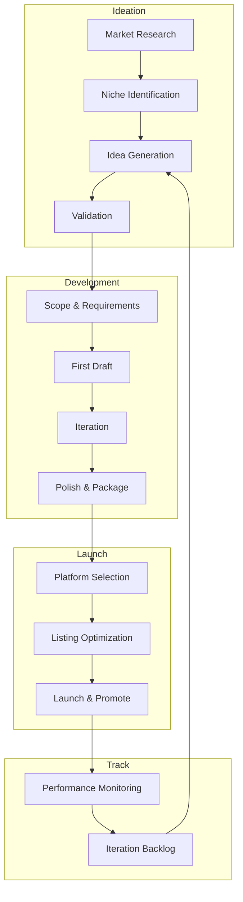

# Passive Income Generation Agent System

> Systematic ideation, development, and tracking for digital passive income streams. Optimized for technical founders with software engineering + creative skills.

---

## System Overview



---

## Income Streams

| Stream | File | Revenue Model | Timeline to First $ |
|--------|------|---------------|---------------------|
| **AI Templates** | `ai-templates.md` | $27-197 per sale | 2-4 weeks |
| **Technical Content** | `content-marketing.md` | Subscriptions + sponsorships | 2-3 months |
| **Print on Demand** | `print-on-demand.md` | $5-15 margin per item | 2-6 weeks |

---

## Your Competitive Advantages

Based on positioning analysis:

1. **Technical Depth** - Can build tools, not just templates
2. **Creative Execution** - AI-assisted design at scale
3. **Problem-Solving** - Understand developer pain points
4. **Systems Thinking** - Can automate and scale

### High-ROI Focus Areas

| Area | Why It Works for You |
|------|---------------------|
| AI for Creative Pros | Low competition, can code real tools |
| Small Business Ops | Underserved, $97-197 price points |
| Developer Education | Authority from experience |
| Niche POD (devs/tech) | Clear audience, original designs |

---

## Platform Comparison

### Digital Products

| Platform | Best For | Fees | Audience |
|----------|----------|------|----------|
| **Gumroad** | Quick launch, testing | 10% + processing | Built-in discovery |
| **Stan Store** | Creators, bundles | $29-99/mo | Your audience |
| **Lemonsqueezy** | SaaS, subscriptions | 5% + processing | Developer-friendly |
| **Etsy** | Templates, POD | 6.5% + fees | Massive search traffic |

### Content Monetization

| Platform | Best For | Revenue Share | Growth Path |
|----------|----------|---------------|-------------|
| **Substack** | Deep expertise | 10% of paid | Newsletter → Community |
| **Medium** | Broad reach | Partner Program | Discovery + SEO |
| **Dev.to** | Developer cred | Sponsorships | Authority building |
| **Patreon** | Community | 5-12% | Tiered membership |

---

## Revenue Projections (Conservative)

### Year 1 Targets

| Stream | Monthly Target | Annual | Effort/Week |
|--------|----------------|--------|-------------|
| AI Templates (5 products) | $500-1500 | $6K-18K | 4-6 hrs |
| Content (500 subscribers) | $200-500 | $2.4K-6K | 3-4 hrs |
| POD (20 designs) | $100-300 | $1.2K-3.6K | 2-3 hrs |
| **Combined** | **$800-2300** | **$9.6K-27.6K** | **9-13 hrs** |

### Scaling Path (Year 2+)

- AI Templates: Add SaaS tier ($29-99/mo subscriptions)
- Content: Paid community, courses, sponsorships
- POD: Expand winning designs, new niches

---

## Tracking System

Each agent maintains project files:

```
passive-income-agent/
├── INDEX.md                    # This file
├── ai-templates.md             # Template ideation agent
├── content-marketing.md        # Article/content agent
├── print-on-demand.md          # POD design agent
└── tracking/
    ├── ai-templates-tracker.md     # Product backlog & metrics
    ├── content-tracker.md          # Article ideas & performance
    └── pod-tracker.md              # Design catalog & sales
```

---

## Agent Invocation Patterns

### Quick Ideation
```
"Generate 5 AI template ideas for [niche]"
"Find trending dev topics for article ideas"
"Create POD concepts for [target audience]"
```

### Full Development
```
"Develop AI template: [idea] - full scope and requirements"
"Write article abstract: [topic] with keyword research"
"Design POD product: [concept] with 5 prompt variations"
```

### Tracking Updates
```
"Update tracker: launched [product] on [platform]"
"Log performance: [product] - [sales/views/revenue]"
"Review backlog and prioritize next items"
```

---

## Quick Start

1. **Read each agent file** for detailed prompts and workflows
2. **Initialize trackers** with your existing ideas
3. **Start with highest-ROI**: AI Templates (fastest to revenue)
4. **Build content flywheel**: Articles drive template discovery
5. **POD for brand building**: Reinforces technical identity

---

*See individual agent files for detailed prompts, workflows, and examples.*
