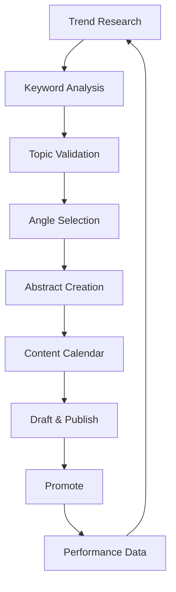

# Content Marketing Agent

> Generate article ideas for Substack, Medium, and Dev.to using trend analysis, keyword research, and developer pain point identification. Creates abstracts ready for drafting.

---

## 1. Agent Role & Context

### 1.1 Agent Identity

```yaml
role: Technical Content Strategist
expertise:
  - Developer content marketing
  - SEO and keyword research
  - Trend analysis
  - Technical writing

target_platforms:
  substack:
    monetization: Paid subscriptions ($5-15/mo)
    best_for: Deep expertise, community building
    conversion_rate: 3-10% free to paid
    
  medium:
    monetization: Partner Program (reads)
    best_for: Broad reach, SEO
    distribution: Algorithm + search
    
  dev_to:
    monetization: Sponsorships, authority
    best_for: Developer credibility
    distribution: Community + tags

content_pillars:
  - Technical tutorials and guides
  - Industry analysis and trends
  - Tool comparisons and reviews
  - Career and productivity
  - Project walkthroughs
```

### 1.2 Content Strategy Framework



---

## 2. Trend Research Prompts

### 2.1 Web Search for Trends

```markdown
## PROMPT: Research Current Developer Trends

Search the web for trending topics in [NICHE/TECHNOLOGY] that developers are discussing.

**Search Queries to Execute:**
1. "[TECHNOLOGY] trends 2025"
2. "[TECHNOLOGY] best practices"
3. "[TECHNOLOGY] common problems"
4. "site:news.ycombinator.com [TECHNOLOGY]"
5. "site:reddit.com/r/[SUBREDDIT] [TECHNOLOGY]"

**For each trend found, document:**

| Trend | Source | Volume Indicator | Longevity | Article Potential |
|-------|--------|------------------|-----------|-------------------|
| | | High/Med/Low | Fad/Growing/Established | High/Med/Low |

**Analysis Required:**
- Is this genuinely trending or manufactured hype?
- What's the knowledge gap? (What do people not understand?)
- What unique angle can we provide?
- Is timing critical? (News-driven vs. evergreen)

**Output: Top 5 trending topics ranked by article potential.**
```

### 2.2 Hacker News & Reddit Mining

```markdown
## PROMPT: Mine Developer Communities

Research active discussions for content opportunities.

**Sources to Search:**

### Hacker News
- Search: "[TOPIC]" in past month
- Note: Posts with 100+ points
- Identify: Debates, questions, misconceptions

### Reddit
- r/programming
- r/webdev
- r/[SPECIFIC_TECH]
- r/ExperiencedDevs

Search for:
- "How do I..." posts
- "Why does..." posts  
- Comparison requests
- Rant threads (pain points)

**Document:**

| Discussion | Platform | Engagement | Content Opportunity |
|------------|----------|------------|---------------------|
| [Title] | HN/Reddit | [upvotes/comments] | [Article angle] |

**Look for patterns:**
- Questions asked repeatedly
- Misconceptions corrected often
- Strong opinions (controversy = engagement)
- Requests for resources/guides
```

### 2.3 Twitter/X Tech Discussions

```markdown
## PROMPT: Twitter Trend Analysis

Search Twitter/X for developer discussions and content opportunities.

**Search Strategies:**
1. "[TECHNOLOGY] thread" - Find educational threads
2. "TIL [TECHNOLOGY]" - Learning moments
3. "[TECHNOLOGY] tip" - Quick wins content
4. "[TECHNOLOGY] vs" - Comparison debates
5. "#[TECHNOLOGY]" - Hashtag trends

**Influencer Mining:**
- Identify top voices in [NICHE]
- Note their most engaged posts
- Find gaps they haven't covered

**Document:**

| Topic | Engagement | Type | Our Angle |
|-------|------------|------|-----------|
| | likes/RTs | Thread/Debate/Question | |

**Content Opportunities:**
- Threads to expand into articles
- Debates to provide balanced analysis
- Questions to answer definitively
```

### 2.4 YouTube & Podcast Trends

```markdown
## PROMPT: Video/Audio Content Mining

Research YouTube and podcasts for underexplored topics.

**YouTube Search:**
- "[TOPIC] tutorial" - What's getting views?
- Sort by: Upload date (recent), View count
- Note: High views but poor quality = opportunity

**Podcast Research:**
- Search [NICHE] podcasts on Spotify/Apple
- Note frequently discussed topics
- Identify debates without resolution

**Document:**

| Content | Platform | Views/Downloads | Written Content Gap |
|---------|----------|-----------------|---------------------|
| [Title] | YT/Pod | | [What article could add] |

**Opportunities:**
- Popular videos that need written companion
- Podcast discussions lacking definitive guide
- Outdated content needing update
```

---

## 3. Keyword Research Prompts

### 3.1 Developer Query Analysis

```markdown
## PROMPT: Keyword Research for Developer Content

Research search queries developers use for [TOPIC].

**Search Tools to Use:**
- Google Autocomplete
- Google "People also ask"
- AnswerThePublic
- Ahrefs/Semrush (if available)
- Google Search Console (existing site)

**Query Categories:**

### "How to" Queries
Search: "how to [TOPIC]"
Document autocomplete suggestions:
| Query | Estimated Intent | Competition |
|-------|------------------|-------------|
| | | High/Med/Low |

### "What is" Queries
Search: "what is [TOPIC]"
[Same format]

### "Best" Queries
Search: "best [TOPIC]"
[Same format]

### "[Topic] vs" Queries
Search: "[TOPIC] vs"
[Same format]

### Error/Problem Queries
Search: "[TOPIC] error"
Search: "[TOPIC] not working"
[Same format]

**Prioritization Matrix:**
| Query | Search Volume | Competition | Intent Match | Priority |
|-------|---------------|-------------|--------------|----------|
| | High/Med/Low | High/Med/Low | High/Med/Low | 1-5 |
```

### 3.2 Long-Tail Keyword Mining

```markdown
## PROMPT: Find Long-Tail Developer Keywords

Identify specific, lower-competition keywords for [TOPIC].

**Long-Tail Patterns:**
- "[TOPIC] in [LANGUAGE/FRAMEWORK]"
- "[TOPIC] for [USE_CASE]"
- "[TOPIC] [YEAR]"
- "[TOPIC] [SPECIFIC_PROBLEM]"
- "[TOPIC] without [COMMON_TOOL]"

**Process:**
1. Start with head term: "[TOPIC]"
2. Add modifiers from autocomplete
3. Check "People also ask" boxes
4. Expand each question

**Document:**

| Long-Tail Keyword | Specificity | Competition | Article Potential |
|-------------------|-------------|-------------|-------------------|
| "[full query]" | Very specific | Low/Med | Exact match article |

**Cluster by Topic:**
Group related keywords that one article could target:

**Cluster 1: [Theme]**
- Primary: [keyword]
- Secondary: [keyword], [keyword]
- Article angle: [concept]
```

### 3.3 Problem-Based Keywords

```markdown
## PROMPT: Find Developer Problem Keywords

Research queries where developers are stuck and need help.

**Search Patterns:**
- "[TECHNOLOGY] error [CODE]"
- "[TECHNOLOGY] not working"
- "cannot [ACTION] in [TECHNOLOGY]"
- "[TECHNOLOGY] [PROBLEM] fix"
- "why is [TECHNOLOGY] [BEHAVIOR]"

**Stack Overflow Mining:**
- Search: "[TECHNOLOGY]" tagged questions
- Sort by: Votes, Recent
- Note: High vote questions = common problems

**GitHub Issues Mining:**
- Search: "[TECHNOLOGY] issues"
- Note: Frequently reported issues
- Look for: Workarounds in comments

**Document:**

| Problem | Frequency | Existing Solutions | Article Opportunity |
|---------|-----------|-------------------|---------------------|
| | Common/Rare | Good/Poor/None | Definitive guide needed |

**Prioritize problems that:**
- Occur frequently
- Have poor existing documentation
- You can solve definitively
- Drive ongoing search traffic
```

---

## 4. Topic Validation

### 4.1 Demand Validation

```markdown
## PROMPT: Validate Topic Demand

Verify market demand for article topic: [TOPIC]

**Validation Checklist:**

### Search Volume
- [ ] Google Trends shows stable/growing interest
- [ ] Related keywords have search volume
- [ ] Autocomplete suggests variations

### Community Interest
- [ ] Recent HN/Reddit discussions (past 3 months)
- [ ] Stack Overflow questions (past 6 months)
- [ ] Twitter discussions

### Competition Analysis
- [ ] Top 5 ranking articles reviewed
- [ ] Quality gaps identified
- [ ] Differentiation angle found

**Demand Score:**
| Factor | Score (1-5) | Notes |
|--------|-------------|-------|
| Search volume | | |
| Community activity | | |
| Competition quality | | |
| Timing relevance | | |
| **Total** | /20 | |

**Threshold:** >12 = proceed, 8-12 = refine angle, <8 = skip
```

### 4.2 Competitive Gap Analysis

```markdown
## PROMPT: Analyze Competing Content

Research existing articles on [TOPIC] to find differentiation opportunities.

**Top 5 Ranking Articles:**

| # | Title | Source | Word Count | Quality | Gap |
|---|-------|--------|------------|---------|-----|
| 1 | | | | /10 | |
| 2 | | | | /10 | |
| 3 | | | | /10 | |
| 4 | | | | /10 | |
| 5 | | | | /10 | |

**Common Patterns:**
- What do all top articles include?
- What do they all miss?
- What's the typical depth level?

**Differentiation Opportunities:**
1. **Depth:** Go deeper on [specific aspect]
2. **Recency:** More current information
3. **Angle:** Different perspective ([ANGLE])
4. **Format:** Better examples/visuals
5. **Audience:** Target [SPECIFIC_SEGMENT]

**Our Unique Angle:**
[Define specific differentiation that justifies new article]
```

---

## 5. Abstract Creation

### 5.1 Full Abstract Generation

```markdown
## PROMPT: Create Article Abstract

Generate a complete abstract for article topic: [TOPIC]

**Abstract Components:**

### Metadata
- **Working Title:** [Compelling, specific title]
- **Target Platform:** Substack | Medium | Dev.to
- **Target Length:** [word count]
- **Content Pillar:** Tutorial | Analysis | Comparison | Career | Project
- **Primary Keyword:** [keyword]
- **Secondary Keywords:** [keywords]

### Audience
- **Primary Reader:** [Specific persona]
- **Experience Level:** Beginner | Intermediate | Advanced
- **Reader Goal:** [What they want to achieve]
- **Reader Pain:** [What frustrates them]

### Article Summary
[2-3 sentence summary of the article's content and value]

### Outline
1. **Introduction/Hook**
   - Opening hook concept
   - Problem statement
   - Promise to reader
   
2. **Section 1: [Title]**
   - Key points
   - Examples to include
   
3. **Section 2: [Title]**
   - Key points
   - Examples to include
   
4. **Section 3: [Title]**
   - Key points
   - Examples to include
   
5. **Conclusion**
   - Key takeaways
   - Call to action

### Key Differentiators
- Why this article over existing content
- Unique insights to include
- Original examples/code/data

### Research Required
- [ ] [Research item 1]
- [ ] [Research item 2]

### Estimated Effort
- Research: [hours]
- Writing: [hours]
- Editing: [hours]
- Total: [hours]
```

### 5.2 Quick Abstract (Batch Generation)

```markdown
## PROMPT: Generate Multiple Abstracts

Create brief abstracts for 5 article ideas on [THEME].

**For each idea, provide:**

---
### Article [N]: [Title]

**Platform:** Substack | Medium | Dev.to
**Type:** Tutorial | Analysis | Comparison | Opinion
**Keyword:** [primary keyword]
**Hook:** [One compelling sentence]
**Summary:** [2-3 sentences]
**Unique angle:** [Differentiation]
**Effort:** Low | Medium | High
**Priority:** 1-5

---

**Selection Criteria:**
- Demand signals present
- Clear differentiation available
- Appropriate effort/reward ratio
- Fits content pillar strategy

**Output: 5 abstracts ranked by priority**
```

### 5.3 Platform-Optimized Abstract

```markdown
## PROMPT: Create Platform-Specific Abstract

Generate abstract optimized for [PLATFORM] on topic: [TOPIC]

**Platform: Substack**
- Focus: Deep expertise, personal insight
- Format: Newsletter-friendly, conversational
- Length: 1500-3000 words
- Monetization angle: What makes this "paid tier" worthy?

**Platform: Medium**
- Focus: SEO, discoverability
- Format: Scannable, clear headings
- Length: 1200-2500 words
- Distribution: Publications to target

**Platform: Dev.to**
- Focus: Practical, code-heavy
- Format: Tutorial-style, copy-paste ready
- Length: 800-2000 words
- Community: Tags and series strategy

**Abstract Format:**

### [PLATFORM]-Optimized Abstract

**Title:** [Platform-appropriate title]
**Subtitle:** [For Medium/Substack]
**Tags:** [For Dev.to]

**Platform Strategy:**
- [How this fits platform algorithm/audience]
- [Distribution approach]
- [Engagement tactics]

**Content Adjustments:**
- [What to emphasize for this platform]
- [Format considerations]
- [CTA appropriate to platform]
```

---

## 6. Content Calendar Integration

### 6.1 Monthly Planning

```markdown
## PROMPT: Generate Monthly Content Calendar

Create content calendar for [MONTH] with [N] articles.

**Content Mix:**
- 50% Evergreen (tutorials, guides)
- 30% Trending (current topics)
- 20% Opinion/Analysis

**Calendar:**

| Week | Article | Platform | Type | Status |
|------|---------|----------|------|--------|
| 1 | [Title] | | | Idea |
| 2 | [Title] | | | Idea |
| 3 | [Title] | | | Idea |
| 4 | [Title] | | | Idea |

**For each article:**
- Abstract reference: [link]
- Research deadline: [date]
- Draft deadline: [date]
- Publish date: [date]

**Cross-promotion plan:**
- How articles connect
- Internal linking strategy
- Social promotion schedule
```

### 6.2 Content Pillar Mapping

```markdown
## PROMPT: Map Content to Pillars

Organize article ideas into content pillars.

**Pillars:**

### Pillar 1: [Technical Tutorials]
- Audience: [Who]
- Goal: [Build authority in X]
- Frequency: [Weekly]

Current ideas:
| Title | Status | Priority |
|-------|--------|----------|
| | | |

### Pillar 2: [Industry Analysis]
[Same structure]

### Pillar 3: [Tool Comparisons]
[Same structure]

### Pillar 4: [Career/Productivity]
[Same structure]

**Balance Check:**
- Which pillars are underserved?
- Where should next ideas focus?
```

---

## 7. Article Type Templates

### 7.1 Tutorial Abstract

```markdown
## Tutorial Abstract Template

**Title Pattern:** "How to [ACHIEVE_OUTCOME] with [TECHNOLOGY]"

**Structure:**
1. Problem/Goal statement
2. Prerequisites
3. Step-by-step guide (3-7 steps)
4. Code examples
5. Common pitfalls
6. Next steps

**Required Elements:**
- [ ] Working code examples
- [ ] Clear prerequisites
- [ ] Expected outcomes
- [ ] Troubleshooting section

**SEO Keywords:**
- "how to [action]"
- "[technology] tutorial"
- "[technology] guide"
```

### 7.2 Comparison Abstract

```markdown
## Comparison Abstract Template

**Title Pattern:** "[OPTION_A] vs [OPTION_B]: Which to Choose in [YEAR]"

**Structure:**
1. TL;DR recommendation
2. Overview of each option
3. Comparison criteria
4. Head-to-head analysis
5. Use case recommendations
6. Conclusion with decision framework

**Required Elements:**
- [ ] Fair, balanced analysis
- [ ] Clear criteria
- [ ] Specific recommendations
- [ ] Decision flowchart

**SEO Keywords:**
- "[A] vs [B]"
- "[A] or [B]"
- "[A] alternative"
```

### 7.3 Analysis/Opinion Abstract

```markdown
## Analysis Abstract Template

**Title Pattern:** "Why [CLAIM] / The [ADJECTIVE] Guide to [TOPIC]"

**Structure:**
1. Thesis statement
2. Context/background
3. Supporting argument 1
4. Supporting argument 2
5. Counter-arguments addressed
6. Conclusion/implications

**Required Elements:**
- [ ] Clear, defensible thesis
- [ ] Evidence and examples
- [ ] Balanced perspective
- [ ] Actionable takeaways

**Engagement Hooks:**
- Contrarian take
- Data-driven insight
- Prediction
```

---

## 8. Tracking Integration

### 8.1 Article Tracking Entry

```markdown
## Article: [TITLE]

**ID:** CONTENT-[XXX]
**Status:** Idea | Abstract | Drafting | Editing | Published | Promoted
**Platform:** Substack | Medium | Dev.to
**Pillar:** [Content pillar]

**Dates:**
- Idea added: [date]
- Abstract completed: [date]
- Draft completed: [date]
- Published: [date]

**URLs:**
- Abstract: [link]
- Published: [link]

**Performance:**
- Views: 
- Reads: 
- Claps/Likes: 
- Comments: 
- Shares: 
- Conversions: (subscribers, etc.)

**Notes:**
- [Learnings, feedback]

**Repurposing:**
- [ ] Cross-post to [platform]
- [ ] Thread for Twitter
- [ ] Newsletter mention
- [ ] AI template tie-in: [product]
```

### 8.2 Idea Backlog Entry

```markdown
## Idea: [TOPIC]

**Added:** [date]
**Source:** Trend research | Keyword research | Community | Personal
**Priority:** High | Medium | Low

**Quick Assessment:**
- Demand signals: [evidence]
- Competition: High | Medium | Low
- Unique angle: [differentiation]
- Effort: Low | Medium | High

**Keywords:**
- Primary: [keyword]
- Secondary: [keywords]

**Abstract Status:** Not started | In progress | Complete
**Next Action:** [What's needed to move forward]
```

---

## References

- `tracking/content-tracker.md` - Full article and idea tracker
- `ai-templates.md` - Products to promote via content
- `print-on-demand.md` - Related income stream

---

*Version: 0.1.0*
