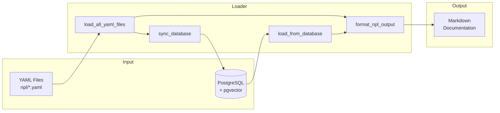
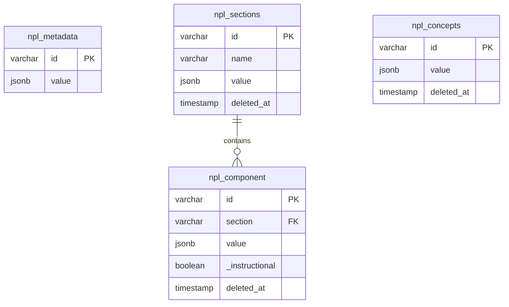
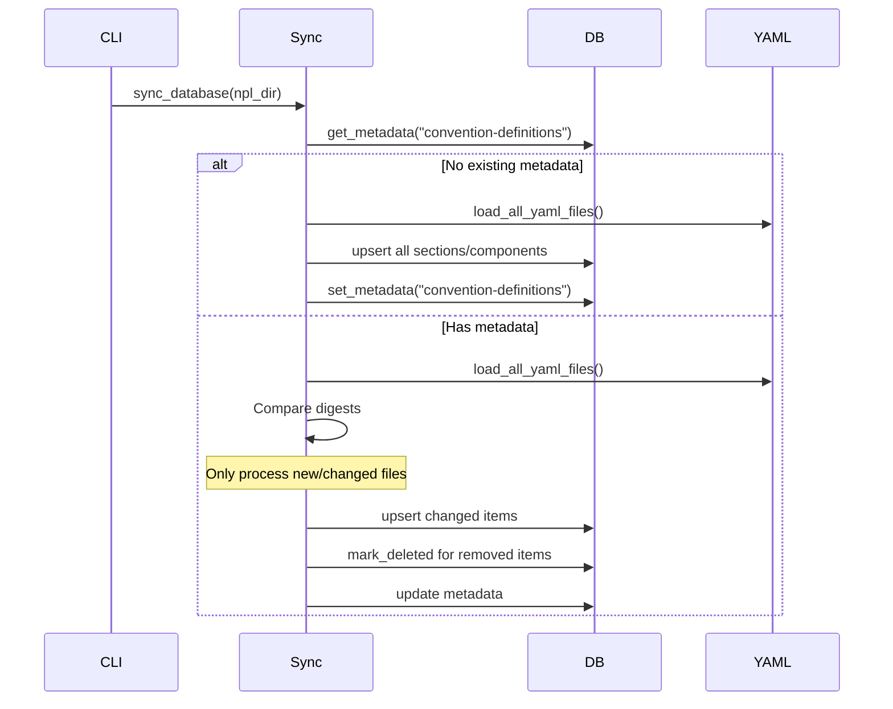

# NPL Loader

CLI tool for loading, syncing, and formatting Noizu Prompt Lingua (NPL) definitions.

## Overview

The NPL loader manages NPL specification files stored as YAML, syncing them to PostgreSQL for production use and outputting formatted markdown documentation.



## CLI Usage

```bash
# Output from database (default, production)
npl-loader

# Sync YAML to database
npl-loader --sync

# Output from YAML directly (development)
npl-loader --yaml

# List files with digests
npl-loader --list

# Include instructional notes
npl-loader --instructions

# Include taxonomy labels
npl-loader --with-labels
```

## Environment Variables

| Variable | Default | Description |
|----------|---------|-------------|
| `NPL_DB_HOST` | localhost | Database host |
| `NPL_DB_PORT` | 5432 | Database port |
| `NPL_DB_NAME` | npl | Database name |
| `NPL_DB_USER` | npl | Database user |
| `NPL_DB_PASSWORD` | npl_secret | Database password |

## Data Model



**Key metadata entries:**
- `convention-definitions`: File inventory with digests for change detection
- `section-order`: Output ordering for sections

## Code Structure

### File Organization

```
npl_loader.py
├── Database Configuration     # Connection setup
├── YAML File Operations       # Load/parse YAML files
├── Section Configuration      # Ordering, references, validation
├── Database Operations        # CRUD with soft-delete
├── Populate/Refresh Logic     # Sync orchestration
├── Database-driven Output     # Load from DB
├── Output Formatting          # Markdown generation
└── Main Entry Point           # CLI handling
```

### Key Functions

#### Loading
| Function | Purpose |
|----------|---------|
| `load_yaml_file(path)` | Parse single YAML file |
| `load_all_yaml_files(npl_dir)` | Recursively load all YAML |
| `load_from_database()` | Load from PostgreSQL |

#### Syncing
| Function | Purpose |
|----------|---------|
| `sync_database(npl_dir)` | Main sync entry point |
| `populate_convention_definitions(conn, npl_dir)` | Full initial sync |
| `refresh_convention_definitions(conn, npl_dir)` | Incremental sync (changed files only) |

#### Database CRUD
| Function | Purpose |
|----------|---------|
| `get_metadata(conn, key)` | Read metadata |
| `set_metadata(conn, key, value)` | Write metadata |
| `upsert_component(...)` | Insert/update component |
| `upsert_section(...)` | Insert/update section |
| `upsert_concept(...)` | Insert/update concept |
| `mark_deleted_for_file(...)` | Soft-delete removed items |
| `mark_deleted_for_missing_files(...)` | Soft-delete from deleted files |

#### Formatting
| Function | Purpose |
|----------|---------|
| `format_npl_output(data, ...)` | Generate complete markdown document |
| `format_section(name, data, ...)` | Format one section |
| `format_component(component, ...)` | Format one component |
| `format_instructional_notes(...)` | Format instructional appendix |

#### Utilities
| Function | Purpose |
|----------|---------|
| `slugify(text)` | Convert name to ID slug |
| `compute_component_digest(component)` | SHA256 for change detection |
| `get_section_order_from_data(data)` | Extract ordering config |
| `validate_references(data)` | Check require/references exist |
| `get_npl_dir(path)` | Resolve NPL directory |

## Sync Process



## Content Types

### Components
Regular NPL definitions in `components:` list. Always included in output.

### Instructional Items
Guidance notes in `instructional:` list. Stored with `_instructional: true` flag. Only included when `--instructions` flag is used. Filtered by `references` field.

## Reference System

Components can declare:
- `require`: Dependencies that must exist (validated on sync)
- `references`: Related components (used to filter instructional items)

```yaml
# Example instructional item
- name: Placeholder Best Practices
  references: [syntax.placeholder, syntax.infill]
  purpose: Guidelines for using placeholders effectively
```

## Output Structure

```
⌜NPL@1.0⌝
# Noizu Prompt Lingua (NPL)
Introduction...

## Syntax
### Placeholder
...

## Directives
### Table
...

---
# Instructional Notes (if --instructions)
## Syntax
### Placeholder Best Practices
...

⌞NPL@1.0⌟
```

## Known Issues

1. **No transaction rollback** - Partial sync failures leave inconsistent state
2. **SQL interpolation** - Table names use f-strings (safe but not ideal)
3. **Orphan records** - Soft-delete may leave orphans if slugs change
4. **stderr output** - `validate_references()` prints warnings to stderr

## TODOs

- [ ] Add embedding generation for semantic search (pgvector)
- [ ] Add `--component` / `--section` flags for partial output
- [ ] Add connection pooling
- [ ] Add JSON output format (`--format json`)
- [ ] Wrap sync in transaction for atomicity
- [ ] Add `--force` flag to skip digest comparison
- [ ] Add `--verbose` / `--quiet` / `--output` flags
