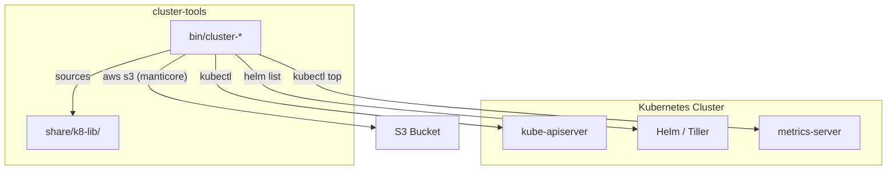

# Cluster Tools — Architecture

## Overview

A collection of Bash CLI utilities for inspecting and monitoring Kubernetes clusters. Each tool is a standalone script that queries the Kubernetes API (via `kubectl`, `helm`, and `metrics-server`) and renders formatted, color-coded terminal dashboards. All scripts share common configuration and formatting through a `share/k8-lib/` shell library.

## System Diagram

## Core Components

| Component | Purpose |
|-----------|---------|
| `cluster-status` | Pod dashboard grouped by namespace/category with status coloring |
| `cluster-nodes` | Node layout showing instance types, capacity, CPU/RAM reservations |
| `cluster-resources` | Per-pod CPU/RAM usage vs requests (requires metrics-server) |
| `cluster-layout` | Node-to-pod mapping + PVC/PV storage layout as markdown |
| `cluster-helm` | Helm release listing with failure highlighting |
| `cluster-manticore` | Manticore Search reader/indexer status, S3 index state |
| `share/k8-lib/bin/config.sh` | Cluster-specific configuration (namespaces, labels, buckets) |
| `share/k8-lib/bin/common.sh` | Shared color definitions, formatting helpers, status utilities |

## Shared Library (`share/k8-lib/`)

All scripts source `share/k8-lib/bin/config.sh` and `share/k8-lib/bin/common.sh` relative to the script directory. The library provides color constants, status-formatting functions, and cluster-specific configuration variables so individual tools stay focused on data retrieval and presentation.

→ *See [arch/shared-library.md](arch/shared-library.md) for details*

## Installation

Scripts install to `~/.local/bin` (overridable via `INSTALL_DIR`) using `make install`. The Makefile globs `bin/cluster-*` and copies each with `install -m 755`.

→ *See [arch/installation.md](arch/installation.md) for details*

## Key Decisions

- **Standalone Bash scripts**: No compiled dependencies — runs anywhere `kubectl` and `bash` are available
- **Shared shell library**: Common config/formatting factored into `share/k8-lib/` to avoid duplication across six tools
- **Markdown output for layout**: `cluster-layout` emits markdown so output can be piped to `glow` or saved as documentation
- **Color-coded status**: All tools use ANSI color to surface problems (red for failures, yellow for pending, green for running)
